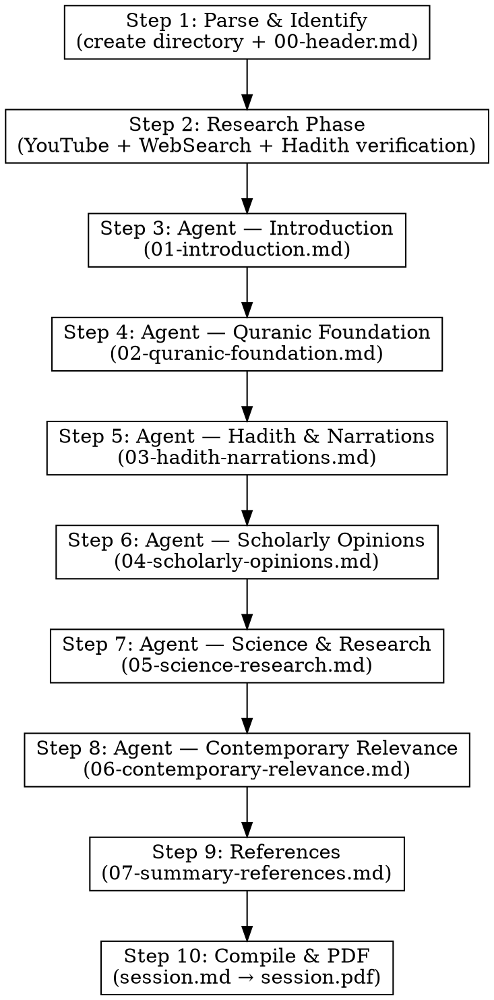

# Discover — Encyclopedic Islamic Knowledge Explorer

## Overview

The `/discover` command launches a fact-rich, wonder-building exploration of any Islamic topic. Unlike `/recite` (academic linguistic analysis) or `/divine` (contemplative message extraction), `/discover` answers one question: **"What do we actually know about this?"**

It collects verified hadith, companion stories, classical scholarly opinions, scientific connections, and modern relevance into a single comprehensive document. The guiding principle: **every section should produce at least one "I didn't know that!" moment.**

## What Discover IS

- **Encyclopedic** — dense with facts, narrations, and references
- **Wonder-building** — presents information in a way that creates awe
- **Multi-voiced** — presents multiple scholarly opinions including disagreements
- **Verified** — every hadith is checked against sunnah.com; scientific claims backed by sources
- **Accessible** — scholarly Urdu, but written for a curious mind, not an academic audience

## What Discover is NOT

**CRITICAL — Read before writing any content:**

- Do NOT write contemplative or spiritual prose (that's `/divine`)
- Do NOT analyze root words, morphological forms, or balagha (that's `/recite`)
- Do NOT present a single scholarly voice — show **multiple opinions** including disagreements
- Do NOT fabricate hadith, scholarly quotes, or scientific claims
- Do NOT present weak or fabricated hadith without clearly marking them as ضعیف (weak) or موضوع (fabricated)
- Do NOT skip hadith grading — every hadith must be marked as صحیح (authentic), حسن (good), ضعیف (weak), or موضوع (fabricated)
- Do NOT make unsourced scientific claims — link to studies or clearly state when a connection is speculative
- If you catch yourself writing contemplative prose or linguistic analysis — **STOP and refocus on facts and narrations**

## Input Format

The user provides one of:
- A Quranic verse: `/discover 2:255` or `/discover Ayat al-Kursi`
- A verse range: `/discover 2:255-257`
- A Surah: `/discover Surah Al-Qadr`
- A hadith: `/discover the Hadith of Jibreel`
- An Islamic concept: `/discover Laylatul Qadr`, `/discover the concept of Tawakkul`
- A historical event: `/discover the story of Khidr`, `/discover the Battle of Badr`
- A theme: `/discover angels in Islam`, `/discover signs of the Day of Judgment`

For ambiguous or overly broad inputs, identify 2-3 possible scopes and confirm with the user before proceeding.

## The 7 Sections

### Section 1: مقدمہ — Introduction & Context
**Question: What is this topic and why is it extraordinary?**

Set the scene. Build awe immediately. Why should the reader care? What makes this topic remarkable in Islamic tradition? Connect it to the broader framework of Quran and Sunnah. This is the "hook" — like Furqan Qureshi opening with the Quran's description of night as a separate creation before getting to Laylatul Qadr.

- 2-3 paragraphs
- Start with something surprising or little-known
- Establish why this topic matters in Islamic tradition
- Preview what the reader will discover

### Section 2: قرآنی بنیاد — Quranic Foundation
**Question: What does the Quran say about this topic?**

Comprehensive collection of all relevant ayat. This is not interpretation — it is **evidence gathering**.

- Primary ayat directly about the topic with 3+ translations (Dr. Mustafa Khattab, Abdel Haleem, Muhammad Asad)
- Secondary ayat that relate to, support, or expand the topic
- Cross-references showing how the Quran builds the theme across multiple surahs
- Link every ayah to quran.com — do NOT embed Arabic text
- Note where translations differ and what each captures
- Minimum 5 ayat, more for broad topics

### Section 3: احادیث و روایات — Hadith & Narrations
**Question: What did the Prophet (PBUH), companions, and early scholars narrate about this?**

**This is the densest section — the heart of `/discover`.**

Sub-sections:
1. **صحیح احادیث — Authentic Hadith** — hadith from Bukhari, Muslim, and other Sahih collections, with:
   - Narrator (راوی)
   - Collection and number (e.g., صحیح بخاری ۲۰۱۴)
   - Grading (صحیح/حسن/ضعیف)
   - Full narration in Urdu
   - Link to sunnah.com where available

2. **صحابہ کے واقعات — Companion Stories** — historical incidents involving companions that illuminate the topic. These are the "I didn't know that!" narrations — like Ibn Umar seeing Abu Jahl crawling from a pit in Badr, or Hasan al-Basri observing the sun without rays for 20 consecutive years on the 24th morning.

3. **تابعین و اسلاف — Early Scholars** — narrations from Tabi'in and early generations that add depth

Every hadith MUST be verified. Use WebSearch to check against sunnah.com before citing. If a narration cannot be verified, clearly state: "یہ روایت کی تصدیق sunnah.com سے نہیں ہو سکی — احتیاط لازم ہے۔"

### Section 4: علمائے کرام کی آراء — Scholarly Opinions
**Question: What have scholars — classical and contemporary — said about this?**

Present **multiple perspectives**, including disagreements. This section should feel like a roundtable, not a monologue.

Sub-sections:
1. **کلاسیکی علماء — Classical Scholars** — opinions from:
   - Ibn Abbas, Ibn Mas'ud (Companions)
   - Imam Razi (Tafsir Kabir)
   - Imam Qurtubi (Al-Jami' li-Ahkam al-Quran)
   - Ibn Kathir (Tafsir Ibn Kathir)
   - Imam Tabari (Jami' al-Bayan)
   - Imam Nawawi, Imam Ghazali, Ibn Qayyim, Ibn Taymiyyah
   - Other relevant classical authorities

2. **معاصر علماء — Contemporary Scholars** — perspectives from:
   - YouTube transcript sources (Nouman Ali Khan, Yasir Qadhi, Omar Suleiman, Hamza Yusuf, Mufti Menk, Abdul Nasir Jangda, Furqan Qureshi, Mufti Tariq Masood)
   - Academic scholars (Angelika Neuwirth, Nicolai Sinai, Carl Ernst — where relevant)

3. **اختلافِ رائے — Points of Disagreement** — where scholars differ, present both sides fairly. Do NOT take sides — present evidence and let the reader decide. Like Ibn Abbas's three arguments for the 27th night vs. Imam Shafi'i's preference for the 21st.

### Section 5: سائنس اور جدید تحقیق — Science & Modern Research
**Question: What does modern science and research reveal about this topic?**

This section connects Islamic knowledge with scientific discovery — NOT to "prove" the Quran, but to show where knowledge converges.

- **Scientific connections** — cosmology, psychology, medicine, biology, physics where relevant
- **Peer-reviewed studies** — cite actual studies with authors and publication names
- **Modern discoveries** — recent findings that relate to the topic (e.g., the universe being inherently dark relating to night as a creation)
- **Psychological/sociological research** — studies on fasting, prayer, charity, community, etc.
- Use WebSearch to find real studies — do NOT fabricate study names or findings
- Clearly separate established science from speculative connections
- Mark speculative connections as: "یہ ربط قیاسی ہے — سائنسی طور پر ابھی ثابت نہیں"

### Section 6: آج کی دنیا میں — Contemporary Relevance
**Question: How does this topic connect to our world right now?**

This is NOT the sharp political critique of `/divine`'s Layer 6 — it is **informational relevance**. Show how the topic connects to modern life.

Sub-sections:
1. **عصرِ حاضر میں مطابقت — Modern Application** — how this knowledge applies to daily life in 2026
2. **ٹیکنالوجی اور سائنس — Technology & Science** — connections to AI, social media, modern medicine, etc.
3. **عام غلط فہمیاں — Common Misconceptions** — myths, misunderstandings, and fabricated narrations that circulate on social media about this topic — debunk them with evidence
4. **عملی نکات — Practical Takeaways** — what the reader can DO with this knowledge

Use WebSearch for current events, headlines, and statistics.

### Section 7: خلاصہ و حوالہ جات — Summary & References
**Question: What are the key takeaways and where can the reader go deeper?**

Sub-sections:
1. **اہم نکات — Key Takeaways** — 7-10 bullet points summarizing the most important discoveries
2. **قرآنی حوالے — Quranic References** — all ayat cited, with quran.com links
3. **احادیث کے حوالے — Hadith References** — all hadith cited, with sunnah.com links and grading
4. **علماء کے حوالے — Scholar Sources** — books, YouTube links, articles
5. **سائنسی حوالے — Scientific Sources** — studies, articles, reports
6. **ویب مصادر — Web Sources** — all web sources used

## Session Directory Structure

Each session creates a directory under `sessions/`:

```
sessions/YYYY-MM-DD-discover-[name]/
  research/
    nouman-ali-khan.txt         ← YouTube transcript
    omar-suleiman.txt           ← YouTube transcript
    hamza-yusuf.txt             ← YouTube transcript
    dr-israr-ahmed.txt          ← YouTube transcript
    yasir-qadhi.txt             ← YouTube transcript
    mufti-menk.txt              ← YouTube transcript
    abdul-nasir-jangda.txt      ← YouTube transcript
    furqan-qureshi.txt          ← YouTube transcript
    mufti-tariq-masood.txt      ← YouTube transcript
    hadith-verification.md      ← Verified hadith with grading
    scientific-research.md      ← WebSearch results for science
    current-events.md           ← WebSearch results for Section 6
    index.md                    ← Research index
  parts/
    00-header.md                ← Meta: title, date, topic, scope
    01-introduction.md          ← Section 1: Introduction & Context
    02-quranic-foundation.md    ← Section 2: Quranic Foundation
    03-hadith-narrations.md     ← Section 3: Hadith & Narrations (LONGEST)
    04-scholarly-opinions.md    ← Section 4: Scholarly Opinions
    05-science-research.md      ← Section 5: Science & Modern Research
    06-contemporary-relevance.md ← Section 6: Contemporary Relevance
    07-summary-references.md    ← Section 7: Summary & References
  session.md                    ← Compiled from all parts
  session.pdf                   ← Final PDF
```

## Execution Flow



### Step 1: Parse and Identify

- Resolve the user's input to a specific topic, scope, and related Quranic/Hadith references
- For ambiguous inputs, present 2-3 options and confirm with user
- Create the session directory: `sessions/YYYY-MM-DD-discover-[name]/parts/` and `sessions/YYYY-MM-DD-discover-[name]/research/`
- Write `parts/00-header.md`:

```markdown
# دریافت: [موضوع کا نام]

**تاریخ:** YYYY-MM-DD
**نوعیت:** تحقیقی و معلوماتی — قرآن، حدیث، سائنس اور عصری مطابقت
**موضوع:** [موضوع کی تفصیل]
**دائرہ کار:** [قرآنی حوالے، متعلقہ احادیث، سائنسی پہلو]

> *یہ تحقیق قرآن، صحیح احادیث، علمائے کرام کی آراء، جدید سائنسی تحقیق اور عصرِ حاضر کی مطابقت پر مبنی ہے۔ ہر حدیث کی تصدیق اور درجہ بندی کی گئی ہے۔*

---
```

- Present the header and topic scope to confirm with the user before proceeding

### Step 2: Research Phase

Three-pronged research — all launched in parallel where possible.

#### YouTube Transcript Fetching

Search for each scholar's lectures with **fact-focused** queries:

```bash
# Fact-focused search queries
yt-dlp "ytsearch5:Nouman Ali Khan [topic] quran explanation" --flat-playlist --print "%(id)s | %(title)s"
yt-dlp "ytsearch5:Omar Suleiman [topic] hadith story" --flat-playlist --print "%(id)s | %(title)s"
yt-dlp "ytsearch5:Hamza Yusuf [topic] Islam wisdom" --flat-playlist --print "%(id)s | %(title)s"
yt-dlp "ytsearch5:Dr Israr Ahmed [topic] dars quran" --flat-playlist --print "%(id)s | %(title)s"
yt-dlp "ytsearch5:Yasir Qadhi [topic] tafseer explanation" --flat-playlist --print "%(id)s | %(title)s"
yt-dlp "ytsearch5:Mufti Menk [topic] lesson" --flat-playlist --print "%(id)s | %(title)s"
yt-dlp "ytsearch5:Abdul Nasir Jangda [topic] quran" --flat-playlist --print "%(id)s | %(title)s"
yt-dlp "ytsearch5:Furqan Qureshi [topic] quran" --flat-playlist --print "%(id)s | %(title)s"
yt-dlp "ytsearch5:Mufti Tariq Masood [topic] hadith" --flat-playlist --print "%(id)s | %(title)s"
```

Launch all searches **in parallel**. Select the most relevant video per scholar.

Fetch transcripts:

```bash
pipx run youtube-transcript-api <VIDEO_ID> 2>/dev/null | python3 -c "
import ast, sys
data = ast.literal_eval(sys.stdin.read())
for entry in data[0]:
    print(entry['text'])
" > sessions/YYYY-MM-DD-discover-[name]/research/<scholar-name>.txt
```

Launch multiple transcript fetches **in parallel**. Verify each is non-empty and relevant.

#### Hadith Verification

Run WebSearch queries to verify hadith on sunnah.com:

```
# For each hadith the topic is known to involve
WebSearch: "site:sunnah.com [hadith keyword]"
WebSearch: "site:islamweb.net [hadith keyword] صحة"
```

Save all verified hadith to `research/hadith-verification.md` with:
- Arabic text or transliteration
- Collection, book, number
- Grading (صحیح/حسن/ضعیف/موضوع)
- Link to sunnah.com

#### Scientific Research

Run WebSearch queries for scientific connections:

```
WebSearch: "[topic] scientific research study"
WebSearch: "[topic] psychology study peer reviewed"
WebSearch: "[topic] modern science discovery"
```

Save to `research/scientific-research.md`.

#### Current Events

Run WebSearch queries for contemporary relevance:

```
WebSearch: "[topic] news 2026"
WebSearch: "[topic] modern world relevance"
WebSearch: "[topic] technology AI 2026"
```

Save to `research/current-events.md`.

#### Research Index

Create `research/index.md` listing all fetched transcripts with scholar name, video URL, and brief note.

#### Priority Scholars Per Section

Natural affinities:
- **Section 1 (Introduction)**: Furqan Qureshi, Mufti Menk (accessible, awe-building)
- **Section 2 (Quranic Foundation)**: Nouman Ali Khan, Dr. Israr Ahmed (Quranic cross-referencing)
- **Section 3 (Hadith)**: Mufti Tariq Masood, Yasir Qadhi (hadith-heavy, narrator chains)
- **Section 4 (Scholarly Opinions)**: Yasir Qadhi, Hamza Yusuf (classical knowledge, academic breadth)
- **Section 5 (Science)**: Furqan Qureshi, WebSearch (scientific connections)
- **Section 6 (Contemporary)**: Omar Suleiman, WebSearch (current events, social relevance)

### Step 3: Dispatch Agent — Introduction

Write to `parts/01-introduction.md`

**Agent must read:** All research transcripts in `research/` directory

**Content:**
- 2-3 paragraphs setting the scene
- Start with something surprising or little-known — a fact that makes the reader lean in
- Establish why this topic matters in Islamic tradition
- Preview what the reader will discover
- Build genuine awe — like a documentary opening

**Tone:** Engaging, informative, wonder-building. Not academic, not contemplative — like a brilliant teacher starting a lecture.

### Step 4: Dispatch Agent — Quranic Foundation

Write to `parts/02-quranic-foundation.md`

**Agent must read:** `parts/01-introduction.md` and `research/` transcripts

**Content:**

```markdown
## قرآنی بنیاد

### بنیادی آیات
[Primary ayat with 3 translations each — Khattab, Abdel Haleem, Asad]

### متعلقہ آیات
[Secondary ayat that expand the theme — with Urdu translation and quran.com links]

### قرآنی ربط
[How the Quran builds this theme across surahs — thematic connections]
```

Minimum 5 ayat for narrow topics, 10+ for broad topics. Every ayah linked to quran.com.

### Step 5: Dispatch Agent — Hadith & Narrations

Write to `parts/03-hadith-narrations.md`

**Agent must read:** Previous parts AND `research/hadith-verification.md`

**This is the LONGEST and most important section for `/discover`.**

**Content:**

```markdown
## احادیث و روایات

### صحیح احادیث
[Each hadith with: narrator, collection, number, grading, full Urdu text, sunnah.com link]

### صحابہ کے واقعات
[Companion stories — the "I didn't know that!" narrations]

### تابعین و اسلاف
[Early scholar narrations]
```

Every hadith MUST include grading. Unverified narrations must be flagged.

### Step 6: Dispatch Agent — Scholarly Opinions

Write to `parts/04-scholarly-opinions.md`

**Agent must read:** Previous parts and research transcripts

**Content:**

```markdown
## علمائے کرام کی آراء

### کلاسیکی علماء
[Classical scholar opinions with book references]

### معاصر علماء
[Contemporary scholar perspectives from transcripts]

### اختلافِ رائے
[Points of disagreement — present both/all sides fairly]
```

### Step 7: Dispatch Agent — Science & Modern Research

Write to `parts/05-science-research.md`

**Agent must read:** Previous parts AND `research/scientific-research.md`
**Agent must run:** Additional WebSearch for specific scientific claims

**Content:**

```markdown
## سائنس اور جدید تحقیق

### سائنسی حقائق
[Established scientific connections]

### جدید تحقیقات
[Recent studies and findings — with source citations]

### قیاسی روابط
[Speculative connections — clearly marked as speculative]
```

### Step 8: Dispatch Agent — Contemporary Relevance

Write to `parts/06-contemporary-relevance.md`

**Agent must read:** Previous parts AND `research/current-events.md`
**Agent must run:** WebSearch for latest news relevant to the topic

**Content:**

```markdown
## آج کی دنیا میں

### عصرِ حاضر میں مطابقت
[How this applies to modern life]

### ٹیکنالوجی اور سائنس
[Technology connections — AI, social media, modern life]

### عام غلط فہمیاں
[Common misconceptions and myths — debunked with evidence]

### عملی نکات
[Practical takeaways — what the reader can DO]
```

### Step 9: References

Write to `parts/07-summary-references.md`

**Content:**

```markdown
## خلاصہ

### اہم نکات
- [7-10 bullet points — the most important discoveries from this session]

---

## حوالہ جات

### قرآنی حوالے
- [All ayat cited with quran.com links]

### احادیث کے حوالے
- [All hadith with collection, number, grading, sunnah.com links]

### علماء کے حوالے
- [Scholar sources with book names and YouTube links]

### سائنسی حوالے
- [Scientific studies and articles]

### ویب مصادر
- [All web sources used]
```

### Step 10: Compile and Generate PDF

1. **Compile** all parts in order (00 through 07) into `sessions/YYYY-MM-DD-discover-[name]/session.md`:

```bash
cat parts/00-header.md > session.md
echo "" >> session.md
cat parts/01-introduction.md >> session.md
echo "" >> session.md
cat parts/02-quranic-foundation.md >> session.md
echo "" >> session.md
cat parts/03-hadith-narrations.md >> session.md
echo "" >> session.md
cat parts/04-scholarly-opinions.md >> session.md
echo "" >> session.md
cat parts/05-science-research.md >> session.md
echo "" >> session.md
cat parts/06-contemporary-relevance.md >> session.md
echo "" >> session.md
cat parts/07-summary-references.md >> session.md
```

2. **Generate PDF** using the md-to-pdf skill:

```bash
node .claude/skills/md-to-pdf/convert.mjs sessions/YYYY-MM-DD-discover-[name]/session.md
```

### Step 11: Present Summary

After generating the PDF, present the user with:
1. The topic in one sentence
2. The most surprising discovery from each section (7 bullet points)
3. Total hadith cited with grading breakdown
4. The directory path: `sessions/YYYY-MM-DD-discover-[name]/`
5. The PDF path: `sessions/YYYY-MM-DD-discover-[name]/session.pdf`

## Language and Format Rules

- **All output must be in scholarly Urdu**
- Keep Arabic Islamic terms, transliterations, scholar names, book titles, and URLs in original form
- Do not embed Arabic ayah text — link to quran.com (e.g., `[آیت پڑھیں](https://quran.com/2/255)`)
- Do not embed Arabic hadith text — provide Urdu translation and link to sunnah.com
- Allow transliterations where they aid understanding
- Use WebSearch and WebFetch to verify references from sunnah.com, quran.com, altafsir.com, islamweb.net
- Never fabricate quotes, references, or scholarly opinions
- When uncertain about a reference, state the limitation clearly
- Every hadith must include grading: صحیح، حسن، ضعیف، یا موضوع

## Adaptive Length Guidelines

The skill should scale to the topic's breadth:

- **Narrow topic** (single ayah, one hadith, specific ruling): ~250-350 lines
  - Sections 1, 5, 6 can be shorter
  - Section 3 (Hadith) still gets full treatment

- **Medium topic** (a surah, a concept like tawakkul, a specific event): ~400-500 lines
  - All sections get balanced treatment
  - Section 3 and 4 are the longest

- **Broad topic** (angels in Islam, the Day of Judgment, story of Musa): ~500-700 lines
  - Sections 2, 3, and 4 are the longest
  - Section 3 may need sub-topics

## Important Notes

- Each agent **must read** the specified previous parts for continuity — do not skip this
- The encyclopedic, fact-rich voice must be maintained throughout — if any section starts feeling contemplative or academic, refocus on narrations and facts
- Section 3 (Hadith & Narrations) is the heart of this skill — it must be the most detailed section
- Present scholarly disagreements fairly — this skill does NOT take sides
- If any agent fails, its partial file will be missing — check before compiling
- The final PDF should feel like reading an Islamic encyclopedia entry — rich, referenced, and full of wonder

## Scholarly Sources

### Primary YouTube Research Targets

1. **Nouman Ali Khan** — Bayyinah Institute; Quranic cross-referencing, accessible explanation
2. **Dr. Omar Suleiman** — Yaqeen Institute; hadith stories, contemporary relevance
3. **Hamza Yusuf** — Classical Islamic thought, philosophy, deep scholarly breadth
4. **Dr. Israr Ahmed** (1932–2010) — Urdu Dars-e-Quran; structured Quranic analysis
5. **Dr. Yasir Qadhi** — Long-form tafseer; blends academic and traditional approaches
6. **Mufti Menk** — Accessible, awe-building, wide-audience appeal
7. **Abdul Nasir Jangda** — Qalam Institute; hadith narrations, historical context
8. **Furqan Qureshi** — Encyclopedic Urdu Islamic content; scientific connections, wonder-building narrations
9. **Mufti Tariq Masood** — Urdu; hadith-heavy, detailed narrator chain discussion

### Additional Scholars (for Section 4 — Scholarly Opinions)

- **Assim Al-Hakeem** — fatwa/rulings, practical Islamic guidance
- **Dr. Shabir Ally** — academic, interfaith perspective
- **Angelika Neuwirth** — academic Quranic studies (when relevant)
- **Nicolai Sinai** — historical-critical analysis (when relevant)

### Classical Authorities (for Section 4)

- Ibn Abbas, Ibn Mas'ud (Companions)
- Imam Tabari (Jami' al-Bayan)
- Imam Razi (Tafsir Kabir)
- Imam Qurtubi (Al-Jami' li-Ahkam al-Quran)
- Ibn Kathir (Tafsir Ibn Kathir)
- Imam Nawawi (Sharh Sahih Muslim)
- Imam Ghazali (Ihya Ulum al-Din)
- Ibn Qayyim al-Jawziyya
- Ibn Taymiyyah
- Mufassir Muqatil ibn Hayyan
- Imam Ibn Abi Hatim
- Hasan al-Basri (Tabi'i)
