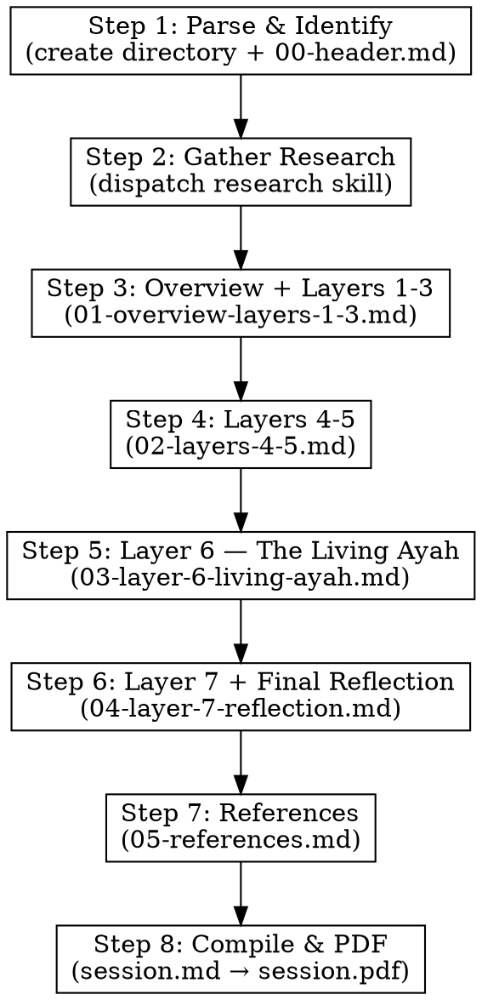

# Divine — Layered Exploration of Allah's Message

## Overview

The `/divine` command launches a deep conceptual exploration of a Quranic verse, passage, surah, or theme. Unlike `/recite` (which performs academic analysis — root words, tafseer comparison, balagha), divine asks one question only: **"What does Allah want to tell us?"**

The exploration peels back **7 layers of meaning**, progressively deepening from surface reading to divine perspective. The output is a single contemplative voice — no dual-scholar debate, no technical terminology — just the idea, the message, the challenge.

## What Divine is NOT

**CRITICAL — Read before writing any content:**

- Do NOT analyze root words or morphological forms
- Do NOT compare classical tafaseers in tables
- Do NOT grade hadith chains or cite isnad
- Do NOT discuss balagha or rhetorical devices by name (no iltifat, no tashbih terminology)
- Do NOT use dual-scholar personas
- Do NOT pose academic bridging questions between layers
- Do NOT structure content like the `recite` or `quran-explorer` skills
- If you catch yourself writing "the root of this word is..." or "Al-Tabari says..." — **STOP and refocus on the message**

Scholars are quoted to illuminate ideas, not to demonstrate academic breadth.

## Input Format

The user provides one of:
- A specific ayah: `/divine 2:255` (Surah:Ayah)
- An ayah range: `/divine 2:255-257`
- A Surah: `/divine Surah Al-Kahf`
- A named verse: `/divine Ayat al-Kursi`
- A theme or event: `/divine the story of Musa and Firawn`
- A concept: `/divine patience in tribulation`

For themes/concepts, identify the core passage(s) that best capture it and confirm with the user before proceeding.

## The 7 Layers of Understanding

Each layer answers a distinct question. Each breaks through the ceiling of the previous one.

### Layer 1: The Surface (ظاہری پیغام)
**Question: What does it literally say?**

Plain reading. What is described, what event or instruction is stated. No interpretation — just the text speaking for itself. Include 2-3 translations side by side (Dr. Mustafa Khattab, Abdel Haleem, Muhammad Asad) so the reader sees the range of meaning even at the surface.

### Layer 2: The Direct Address (براہِ راست خطاب)
**Question: What is Allah directly telling the listener?**

Who is being addressed? What is the command, warning, promise, or comfort? What would a companion hearing it for the first time understand? What did the first generation do with this message? This is the "first pass" interpretation — the immediate, unmissable point.

### Layer 3: The Embedded Principle (اصولِ حکمت)
**Question: What universal truth is embedded beneath the specific words?**

Every ayah carries a specific instruction AND a broader principle. "Do not kill your children out of poverty" is specifically about infanticide — but the embedded principle is about trust in divine provision, about not letting fear of scarcity drive moral compromise. This layer extracts that deeper principle.

### Layer 4: The Human Mirror (آئینۂ انسانی)
**Question: What does this reveal about human nature?**

The Quran is the deepest psychology book ever written. Every prohibition reveals a human weakness. Every encouragement reveals a human potential. Every story reveals a recurring pattern. This layer turns the ayah into a mirror — what does it show us about who we are? Use examples from everyday life, not just Islamic history.

### Layer 5: The Quranic Web (قرآنی ربط)
**Question: How does this connect to the broader Quranic message?**

No ayah exists in isolation. Trace the idea across the Quran. Where else does this theme appear? How does the Quran build, repeat, vary, and deepen this message across different surahs? Reference 5-10 other ayat that echo or expand the theme, showing how the Quran constructs its arguments cumulatively.

### Layer 6: The Living Ayah (زندہ آیت — آج کی دنیا میں)
**Question: What does this demand of us RIGHT NOW, in this moment in history?**

**This is the most critical layer. It must receive the most depth — at minimum as long as Layers 1-5 combined.**

Sub-sections:
1. **امت مسلمہ آج** — The Muslim Ummah today: internal divisions, governance failures, identity crises
2. **عالمی طاقت اور انصاف** — Global power structures: superpowers, conflicts (Palestine, Sudan, Kashmir, Uyghurs), international law failures, media manipulation
3. **ٹیکنالوجی، معیشت اور جدید زندگی** — Technology, economy, and modern life: AI, social media, surveillance capitalism, wealth inequality, climate crisis, modern riba
4. **تکلیف دہ آئینہ** — The uncomfortable mirror: what this ayah says to Muslims themselves — not just to "the other." Challenge both liberal and conservative positions
5. **اگر یہ آیت آج نازل ہوتی** — "If this ayah were revealed today, who would it be addressing? What situation would trigger it?"

Use WebSearch extensively for current events and headlines relevant to the themes.

### Layer 7: The Divine Lens (نظرِ الٰہی)
**Question: What does this reveal about Allah's relationship with His creation?**

The contemplative, spiritual capstone. What does this ayah tell us about how Allah sees us, teaches us, tests us, loves us? What attribute of Allah is most operative here? How does this ayah fit into the larger story of divine-human relationship? This layer should feel quiet and profound after the intensity of Layer 6.

## Session Directory Structure

Each session creates a directory under `sessions/`:

```
sessions/YYYY-MM-DD-divine-[name]/
  parts/
    00-header.md                ← Meta: title, date, verse link, translation
    01-overview-layers-1-3.md   ← High-level overview + Layers 1-3
    02-layers-4-5.md            ← Layers 4-5
    03-layer-6-living-ayah.md   ← Layer 6 (LONGEST section)
    04-layer-7-reflection.md    ← Layer 7 + final reflection
    05-references.md            ← All references
  session.md                    ← Compiled from all parts
  session.pdf                   ← Final PDF
```

## Execution Flow



### Step 1: Parse and Identify

- Resolve the user's input to exact Surah number, ayah number(s)
- For themes/events, use WebSearch to identify the core passage(s) and present 2-3 options for user confirmation
- Create the session directory: `sessions/YYYY-MM-DD-divine-[name]/parts/`
- Write `parts/00-header.md`:

```markdown
# الٰہی پیغام: سورۃ [نام] ([نمبر]:[آیت])

**تاریخ:** YYYY-MM-DD
**نوعیت:** تدبر و تفکر — اللہ کا پیغام سمجھنا
**آیت:** [quran.com link]
**ترجمہ:** [Urdu translation — clear, accessible]
**Research:** research/<topic-key>/

> *یہ تحقیق لسانی تجزیے یا فنی تفسیر کی بجائے قرآنی پیغام کی گہرائی میں اترنے کی کوشش ہے۔ سوال صرف ایک ہے: اللہ ہم سے کیا کہنا چاہتے ہیں؟*

---
```

- Present the link and translation to confirm with the user before proceeding

### Step 2: Gather Research

Dispatch a research subagent to gather scholar transcripts and current events:

- **Topic:** [verse/theme from Step 1]
- **Needs:** transcripts, current-events
- **Mode:** skill-called
- **Minimum transcripts:** 3

The research skill stores results in `research/<topic-key>/`. Transcripts in `research/<topic-key>/transcripts/`, current events in `research/<topic-key>/web/current-events.md`.

If research already exists and current-events is fresh (< 24 hours old), it is reused.

#### Priority Scholars for Divine

When reading transcripts, mine them for **message-level insights** — skip past root word analysis and extract the moments where scholars say "the point Allah is making is..." or "this is really about..."

Natural affinities:
- **Layers 1-2**: Dr. Mustafa Khattab, Mufti Menk, Abdel Haleem (clear, accessible meaning)
- **Layer 3**: Dr. Israr Ahmed, Nouman Ali Khan (extracting universal principles)
- **Layer 4**: Hamza Yusuf, Dr. Omar Suleiman (psychology, human experience)
- **Layer 5**: Dr. Israr Ahmed, Mustansir Mir (Quranic interconnection, nazm)
- **Layer 6**: Dr. Omar Suleiman, Khaled Abou El Fadl, Dr. Yasir Qadhi (current events, social justice)
- **Layer 7**: Hamza Yusuf, Dr. Israr Ahmed (spiritual depth, philosophical contemplation)

### Step 3: Dispatch Agent — Overview + Layers 1-3

Write to `parts/01-overview-layers-1-3.md`

**Agent prompt must include:**
- Read all .txt files in `research/<topic-key>/transcripts/` before writing
- The "What Divine is NOT" constraints (copied from above)

**Content:**

1. **خلاصۂ پیغام** (Overview): 2-3 paragraphs — the "elevator pitch" of what this ayah/passage is about. What is the core message in one breath? This should be compelling and accessible.

2. **پہلی تہہ: ظاہری پیغام** (Layer 1)
3. **دوسری تہہ: براہِ راست خطاب** (Layer 2)
4. **تیسری تہہ: اصولِ حکمت** (Layer 3)

Each layer should end with a **transition sentence** that naturally leads to the next layer — not questions, not academic bridges. This is contemplative writing.

Scholar quotes woven into prose naturally:
> نعمان علی خان کہتے ہیں: "اللہ نے یہ بات اس لیے کہی کیونکه..." — اور یہی بات اس آیت کی تیسری تہہ کو کھولتی ہے...

### Step 4: Dispatch Agent — Layers 4-5

Write to `parts/02-layers-4-5.md`

**Agent must read:** `parts/01-overview-layers-1-3.md` and all .txt files in `research/<topic-key>/transcripts/`

**Content:**

1. **چوتھی تہہ: آئینۂ انسانی** (Layer 4) — psychologically penetrating. Use examples from everyday life, modern struggles, universal human patterns. This is the "mirror" layer.

2. **پانچویں تہہ: قرآنی ربط** (Layer 5) — trace the theme across the Quran. Reference 5-10 other ayat that echo, expand, or nuance this message. Show how the Quran builds its arguments cumulatively — the same truth approached from different angles in different surahs.

### Step 5: Dispatch Agent — Layer 6 (The Living Ayah)

Write to `parts/03-layer-6-living-ayah.md`

**Agent must read:** All previous parts AND `research/<topic-key>/web/current-events.md` AND `research/<topic-key>/transcripts/`
**Agent must run:** WebSearch for latest headlines relevant to the ayah's themes

**This is the LONGEST and most impactful section.**

**Content:**

```markdown
## چھٹی تہہ: زندہ آیت — آج کی دنیا میں

### امت مسلمہ آج
[Muslim Ummah's current state — divisions, governance, identity]

### عالمی طاقت اور انصاف
[Global power, conflicts — Palestine, Sudan, Kashmir, etc., international law failures]

### ٹیکنالوجی، معیشت اور جدید زندگی
[AI, social media, wealth inequality, climate, modern economic exploitation]

### تکلیف دہ آئینہ
[The uncomfortable mirror — what this says to Muslims themselves, challenging both liberal and conservative positions]

### اگر یہ آیت آج نازل ہوتی
["If this ayah were revealed today..." — who would it address? What situation would trigger it?]
```

This layer must feel urgent, specific, and uncomfortable. Not generic platitudes about "applying the Quran today" — concrete, named, current.

### Step 6: Dispatch Agent — Layer 7 + Final Reflection

Write to `parts/04-layer-7-reflection.md`

**Agent must read:** All previous parts

**Content:**

1. **ساتویں تہہ: نظرِ الٰہی** (Layer 7) — contemplative, spiritual, quiet energy. After the intensity of Layer 6, this should feel like stepping into a mosque at fajr. What does this ayah reveal about Allah Himself — His mercy, His wisdom, His patience, His justice?

2. **آخری تدبر** (Final Reflection): 3-5 existential questions for the reader to sit with. Not academic questions — personal, piercing ones. Then a final paragraph that circles back to the opening overview, creating a sense of completion.

### Step 7: References

Write to `parts/05-references.md`

Simpler than recite's references — no tafseer tables, no hadith grading tables.

```markdown
---

## حوالہ جات

### قرآنی حوالے
- [All cross-referenced ayat with quran.com links]

### علماء کے حوالے
- [Scholar sources with YouTube links where applicable]

### کتب و مقالات
- [Books and articles referenced]

### ویب مصادر
- [Web sources used, especially for Layer 6]
```

### Step 8: Compile and Generate PDF

1. **Compile** all parts in order (00 through 05) into `sessions/YYYY-MM-DD-divine-[name]/session.md`:

```bash
cat parts/00-header.md > session.md
echo "" >> session.md
cat parts/01-overview-layers-1-3.md >> session.md
echo "" >> session.md
cat parts/02-layers-4-5.md >> session.md
echo "" >> session.md
cat parts/03-layer-6-living-ayah.md >> session.md
echo "" >> session.md
cat parts/04-layer-7-reflection.md >> session.md
echo "" >> session.md
cat parts/05-references.md >> session.md
```

2. **Generate PDF** using the md-to-pdf skill:

```bash
node .claude/skills/md-to-pdf/convert.mjs sessions/YYYY-MM-DD-divine-[name]/session.md
```

### Step 9: Present Summary

After generating the PDF, present the user with:
1. The core message in 2-3 sentences
2. The most striking insight from each layer (7 bullet points)
3. The directory path: `sessions/YYYY-MM-DD-divine-[name]/`
4. The PDF path: `sessions/YYYY-MM-DD-divine-[name]/session.pdf`
5. The most piercing question from the final reflection

## Language and Format Rules

- **All output must be in scholarly Urdu**
- Keep Arabic Islamic terms, transliterations, scholar names, book titles, and URLs in original form
- Do not embed Arabic ayah text — link to quran.com instead (e.g., `[آیت پڑھیں](https://quran.com/2/255)`)
- Allow transliterations where they aid understanding
- Use WebSearch and WebFetch to verify references from sunnah.com, quran.com, altafsir.com, islamweb.net
- Never fabricate quotes, references, or scholarly opinions
- When uncertain about a reference, state the limitation clearly

## Important Notes

- Each agent **must read** the specified previous parts for continuity — do not skip this
- The contemplative voice must be maintained throughout — if any section starts feeling academic, refocus on the message
- Layer 6 is the heart of this skill — it must be specific, current, and uncomfortable
- Scholar quotes should feel like part of a conversation, not footnotes
- If any agent fails, its partial file will be missing — check before compiling
- The final PDF should feel like reading a deep philosophical essay, not an academic paper
