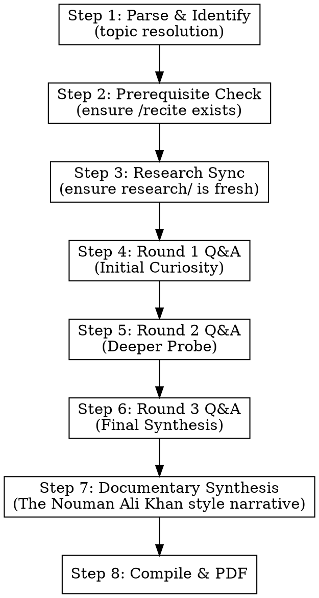

# Fahm (فہم) — Interactive Deep Understanding

## Overview

The `/fahm` command is the "pro" extension of the `/recite` skill. While `/recite` provides a structured study guide, `/fahm` simulates an **interactive learning journey**. 

It dispatches a "Curious Learner" agent who reads the base study guide and asks deep, probing questions across three rounds. A "Scholar" agent answers using authentic research. Finally, the entire Q&A history is synthesized into a single, seamless, flowing documentary-style Urdu narrative in the style of **Nouman Ali Khan**.

## What Fahm IS NOT

- Not a dry academic report.
- Not a list of questions and answers (the final output is synthesized).
- Not a replacement for `/recite` (it depends on it).
- Not for shallow or quick summaries — this is for deep, investigative "why" and "how" questions.

## Input Format

The user provides one of:
- A specific ayah: `/fahm 2:255`
- A range: `/fahm 1:1-7`
- A surah: `/fahm Surah Al-Fatiha`
- An event: `/fahm Solomon and the ant`

## Execution Flow

### Step 1 & 2: Parse and Prerequisite Check

1. Resolve input to a canonical `<topic-key>`.
2. Check for `sessions/*-recite-<topic-key>/`.
3. **If missing**: Internally run the `/recite` workflow first to generate the necessary `session.md` and `parts/`.
4. Create the session directory: `sessions/YYYY-MM-DD-fahm-<topic-key>/parts/`.

### Step 3: Research Sync

Ensure `research/<topic-key>/` contains transcripts and web research. Dispatch `research` skill if any required data is missing or stale (> 24h for current events).

### Step 4: Round 1 — Initial Curiosity (Internal)

- **Learner Agent**: Reads the `recite` session content. Generates 3-5 deep, curious questions (e.g., "Why does this surah start with Alhamdulillah?", "What is the science behind the word 'Al-Hamd'?", "Why is Fatiha placed at the very beginning?").
- **Scholar Agent**: Reads the questions, the `recite` content, and `research/<topic-key>/`. Formulates detailed, authentic answers in Urdu.
- Save to `parts/01-round1-qa.md`.

### Step 5: Round 2 — The Deeper Probe (Internal)

- **Learner Agent**: Reads Round 1 answers. Generates 2-3 follow-up questions probing nuances, connections to other surahs, or linguistic subtleties ("If 'Al-Hamd' means gratitude, how does it differ from 'Shukr' in this context?").
- **Scholar Agent**: Answers using research.
- Save to `parts/02-round2-qa.md`.

### Step 6: Round 3 — The Final Synthesis (Internal)

- **Learner Agent**: Reads Round 2 answers. Asks 1-2 final questions about the overarching wisdom, psychological impact, or "Living Ayah" application for the modern world.
- **Scholar Agent**: Answers.
- Save to `parts/03-round3-qa.md`.

### Step 7: Documentary Synthesis (User-Facing)

**Synthesis Agent Prompt**:
- Read `parts/01` through `03` and the original `recite` session.
- Rewrite the entire journey into a **single, seamless, flowing documentary-style narrative** in scholarly Urdu.
- **Style**: Nouman Ali Khan.
- **Voice**: "At this point, you might wonder... and if you look at the roots... it's incredible because...".
- The narrative should feel like one coherent lecture that has absorbed all the questions and answers.
- **Language**: Urdu script only (A-Z only for URLs/references).
- Save to `parts/04-synthesis.md`.

### Step 8: Compile and Generate PDF

1. **Compile**: `00-header.md` + `04-synthesis.md` + `05-references.md` → `session.md`.
2. **Note**: Do **NOT** include the Round 1-3 Q&A files in the final PDF. They are intermediate "discovery" documents.
3. **PDF**: `node .claude/skills/md-to-pdf/convert.mjs session.md`.

## Language and Format Rules

- **All output must be in scholarly Urdu.**
- Maintain the "Nouman Ali Khan" tone: engaging, pedagogical, and wonder-building.
- Use `WebSearch` to verify any new scientific or historical claims made during the Q&A rounds.
- Never fabricate sources.
- Every claim in the Scholar's answers must be rooted in the `research/` data or verified web sources.

## Important Notes

- The intermediate Q&A files (`01`, `02`, `03`) are essential for the Synthesis Agent to understand the *journey* of discovery.
- If the `recite` session was just generated, ensure its path is passed correctly to the `fahm` agents.
- The final PDF should be a beautiful RTL document ready for deep study.
