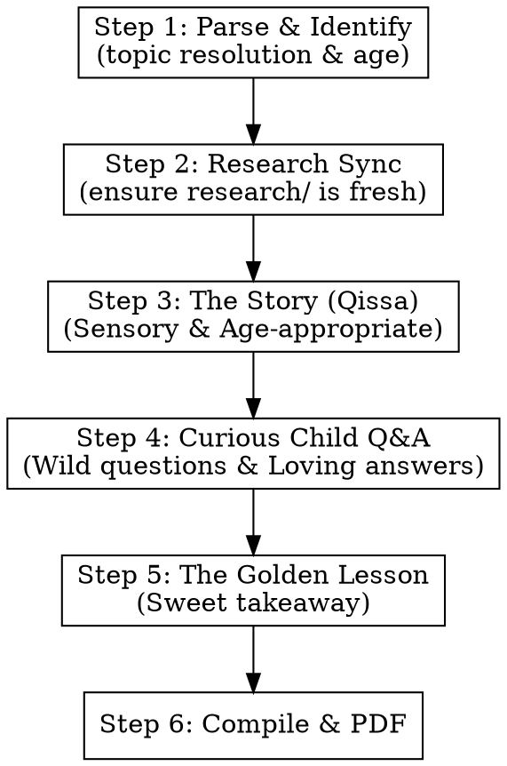

# Noor (نور) — Quranic Storytelling for Kids

## Overview

The `/noor` command is a child-centric version of the Ustadh skills. It is designed to capture a child's imagination by translating abstract Quranic truths into sensory stories and logical but simple analogies. It is built to answer the highly literal and imaginative questions children ask (e.g., "If we are made of mud, why don't we scatter?").

## What Noor IS NOT

- Not a dry academic study guide (that is `/recite`).
- Not a deep investigative inquiry for adults (that is `/fahm`).
- Not for complex theological or linguistic debates.
- Not a "dumbed down" version — it is a "wonder-built" version.

## Input Format

The user provides a topic and optionally an age:
- `/noor 1:1-7 age 5`
- `/noor Solomon and the ant age 7`
- `/noor 2:255` (defaults to age 7)

## Execution Flow

### Step 1 & 2: Parse and Research Sync

1. Resolve input to a canonical `<topic-key>` and extract the target `age` (default 7).
2. Create session directory: `sessions/YYYY-MM-DD-noor-<topic-key>-age-<age>/parts/`.
3. Ensure `research/<topic-key>/` contains standard transcripts and web research.

### Step 3: The Story (Qissa) — Phase 1 (Internal)

- **Storyteller Agent**: Takes the core message of the passage and turns it into a vivid, sensory story.
- **Rules for Age 4-7**: Use animals, colors, family routines, baking, blocks, and nature's magic. Keep sentences short. Focus on Allah's love and kindness.
- **Rules for Age 8-12**: Use space, nature's engineering, historical adventures, and mild logic (how things work).
- **Language**: Easy Urdu (آسان اردو).
- Save to `parts/01-story.md`.

### Step 4: Curious Child Q&A — Phase 2 (Internal)

- **Child Agent**: Acts as an X-year-old child (e.g., Safwan, age 5). Generates 3-4 **highly literal, imaginative, and wild questions** based on the story. 
    - *Examples*: "Why didn't we scatter like dry sand?", "Does Allah have a big kitchen to make all this food?", "Does the ant have a tiny phone to call his friends?".
- **Baba Jani Agent**: Answers these questions with beautiful, child-friendly analogies and a fatherly, loving tone.
    - *Examples*: "Think of how mommy bakes a cake — it starts as flour (mud), but with love and heat, it becomes a strong, yummy cake that doesn't fall apart! Allah 'baked' us with even more love."
- Save to `parts/02-qa.md`.

### Step 5: The Golden Lesson — Phase 3 (Internal)

- **Lesson Agent**: Extracts a single, sweet, actionable "Bedtime Lesson" (سنہری سبق) that the child can apply.
- *Examples*: "Tonight, when you see a tiny bug, remember Allah gave him a voice too!", "Say Alhamdulillah for the water, just like the trees do."
- Save to `parts/03-lesson.md`.

### Step 6: Compile and Generate PDF

1. **Compile**: `00-header.md` + `01-story.md` + `02-qa.md` + `03-lesson.md` → `session.md`.
2. **Kid-Friendly Formatting**: Use emojis 🌟 📖 🐜 🌳 and simple headings.
3. **PDF**: `node .claude/skills/md-to-pdf/convert.mjs session.md`.

## Tone and Language

- **Voice**: A wise, loving, and patient **Baba Jani** (like a father or grandfather).
- **Language**: Simple Urdu script (آسان اردو). No complex theological terms like 'Aalameen' or 'Rob' without a simple analogy.
- **Wonder-Building**: Every explanation should leave the child going "Wow!"
- **No Fear**: Focus on Allah's beauty, creation, and care. Save the "great punishment" discussions for older age groups or specific contexts.
