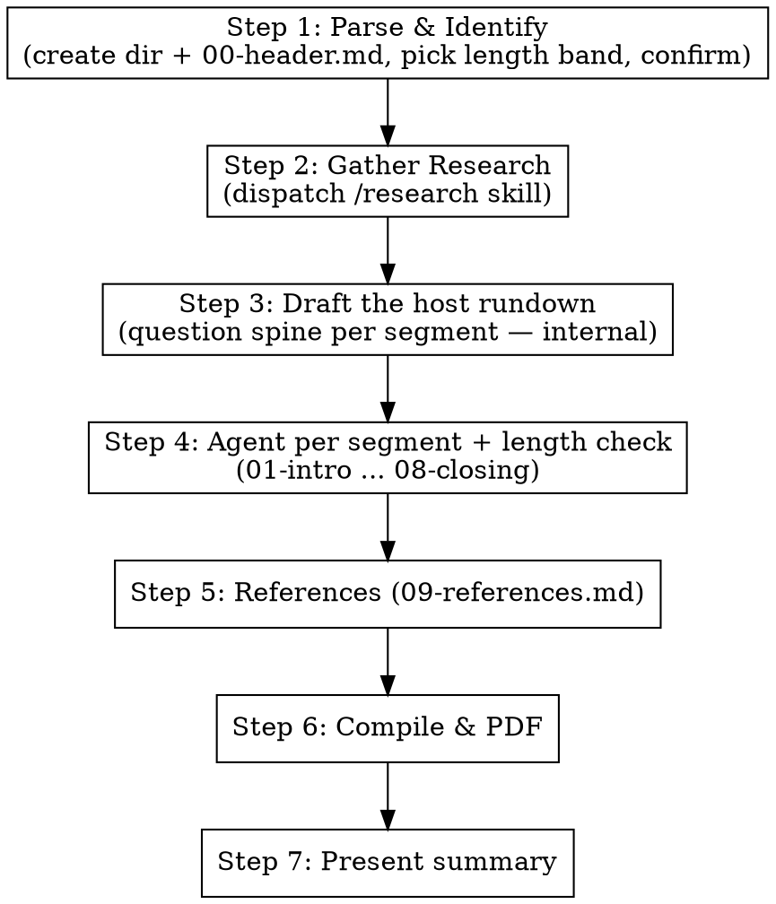

# Podcast — Conversational Scholarly Podcast (پوڈکاسٹ)

## Overview

The `/podcast` command produces a long-form **Urdu podcast transcript** (compiled to PDF) of a
recurring scholarly show. A host — **میزبان: طالبِ علم (the Knowledge Seeker)** — interviews
**two virtual Aalims** about any topic: an event, an act/practice, a hadith, an ayah or range of
ayat, an Islamic concept, or any related theme.

One episode takes the listener from zero to **near-complete understanding**: the authentic basis in
Quran and authentic hadith, deep knowledge at both beginner and advanced levels, the topic's
historical journey, how it applies in this era, the false-but-popular beliefs people wrongly
attribute to Islam, and the natural follow-up questions that arise from the discussion.

The transcript reads like a real 1–3 hour audio/video podcast — but the language is **strictly
simple, conversational Urdu** throughout, even when the content is advanced.

## What this skill is NOT

- **Not** a single-voice lecture (that is `/tadabbur`).
- **Not** an academic ayah-by-ayah study guide (that is `/recite`).
- **Not** an encyclopedic fact dump (that is `/discover`).
- It is a **two-guest interview**, driven by a relentless, curious, plain-spoken host. If a section
  starts reading like an essay or a monologue, STOP and return to question-and-answer dialogue.

## The Cast (recurring across all episodes)

| Role | Label (Urdu) | Lens |
|------|--------------|------|
| Host | **میزبان: طالبِ علم** | The Knowledge Seeker. Drives the conversation with what / why / how / when across every field (linguistic, historical, fiqh, spiritual, scientific, social, contemporary). Asks the simple questions a beginner would AND the sharp ones an advanced listener would. Never lectures — always asks, follows up, and pulls threads out of the answers. |
| Aalim 1 | **عالمِ اصول** | Classical lens: Quran, tafseer, hadith sciences + narrator chains, authentic Islamic history. Grounds everything in primary texts. |
| Aalim 2 | **عالمِ عصر** | Contemporary lens: applying the topic today, real modern situations, and debunking false-but-popular beliefs. |

**Cast rules:**
- Both Aalims have **full knowledge**; the lenses divide *emphasis*, not capability.
- Use the descriptive title-personas above — **never invent personal names** for the Aalims and
  never impersonate a real, named living or historical scholar.
- The cast is **recurring** — keep the same labels every episode so it feels like a real series.
- Where real scholars genuinely differ, the Aalims present that **ikhtilaf** respectfully and
  clearly labelled. Never manufacture disagreement; never contradict established consensus (اجماع).

## The Hard Authenticity Rule (the spine of this skill)

The personas are a **teaching frame**. Every fact stated by any character must be **real and
sourced**. This rule overrides conversational style whenever they conflict.

- Hadith are cited with **source AND grade** (صحیح / حسن / ضعیف / موضوع).
- Ayat link to quran.com; hadith link to sunnah.com.
- Real scholarly opinions are **attributed to the real scholar** who holds them, verified via
  WebSearch. (Unlike `/tadabbur`, attribution is *required* here.)
- **Never fabricate** a hadith, tafseer quote, scholarly opinion, or historical claim.
- When a reference is uncertain or disputed, an Aalim says so openly, in character
  (e.g. «اس بارے میں روایات مختلف ہیں…» or «یہ روایت سنداً کمزور ہے، اس لیے اس پر عقیدہ نہیں بنایا جا سکتا»).
- The myth-busting segment (06) leans hardest on this rule: every "false concept" must be shown to
  be absent from — or contradicted by — authentic sources, with the authentic position cited.

## Input Format

The user provides one of:
- A specific ayah or range: `/podcast 2:255` or `/podcast 103:1-3`
- A surah: `/podcast Surah Al-Asr`
- A named verse: `/podcast Ayat al-Kursi`
- A hadith: `/podcast hadith of Jibril` / `/podcast hadith on intentions`
- An event: `/podcast Hijrah` / `/podcast Battle of Badr`
- An act/practice: `/podcast wudu` / `/podcast tawakkul` / `/podcast sadaqah`
- A concept or theme: `/podcast the concept of rizq` / `/podcast patience in the Quran`

For ambiguous or very broad input, identify 2–3 possible angles and the anchor reference(s) that
would ground the episode, and confirm with the user before proceeding.

## Episode Structure — The 10 Parts

Each part is a separate `parts/NN-*.md` file, written by its own agent, then compiled in order.
Parts 00 (header) and 09 (references) are meta and carry no length share; the eight content parts
(01–08) are sized as a percentage of total transcript length and sum to 100%.

### Part 00 — Header (`00-header.md`)
Meta only (see template in Execution Flow). Episode title, date, topic, anchor reference, research
key, and a one-line intro of the recurring cast.

### Part 01 — تعارف (`01-intro.md`) · ~5%
**Host opens the show.** Warm, simple opening; names the show and the cast; states today's topic and
*why it matters to an ordinary listener*; teases the questions the episode will answer. Ends with the
host turning to the Aalims with the first real question. Pure dialogue.

### Part 02 — قرآن و حدیث میں اصل بنیاد (`02-foundation.md`) · ~13%
**The verified textual foundation.** Host asks: «اس کی اصل بنیاد قرآن اور حدیث میں کہاں ہے؟»
عالمِ اصول lays out the relevant ayat (linked to quran.com) and the authentic hadith (with source +
grade). عالمِ عصر translates each into plain meaning for the listener. Establish what is *definitely*
established from the primary texts before any nuance.

### Part 03 — گہرائی: آسان + عمیق دونوں سطح (`03-depth.md`) · ~30% (LONGEST)
**The deep dive at BOTH levels.** This is the heart of the episode and must be the longest segment.
The host repeatedly asks for "first the simple version, then the deep version." Cover, as the topic
demands: key Arabic words/roots (explained simply), asbab al-nuzul / context, fiqh rulings and the
range of authentic scholarly opinion (ikhtilaf, attributed to real scholars), spiritual/heart
dimension, and any sound scientific/psychological angle. Every advanced point is immediately
re-explained in beginner terms by the host or عالمِ عصر. Keep it as dialogue — host pulls each thread.

### Part 04 — تاریخی سفر (`04-history.md`) · ~13%
**The historical journey, authentically traced.** Prophetic era → the Companions → later Islamic
history → how understanding/practice developed. عالمِ اصول leads with verified history; host keeps
asking «پھر کیا ہوا؟ / یہ ہمیں کیسے معلوم ہے؟». Flag any popular-but-unverified historical story as
such rather than repeating it as fact.

### Part 05 — آج کے دور میں (`05-today.md`) · ~13%
**Application in this era.** عالمِ عصر leads. How does this live in a modern Muslim's life — work,
family, phone, money, society? Tie to real current situations (use the current-events research).
Host asks «اکیسویں صدی میں اس کا کیا مطلب ہے؟ ایک عام نوجوان اس پر کیسے عمل کرے؟».

### Part 06 — غلط فہمیاں اور بدعات (`06-myths.md`) · ~13%
**Myth-busting.** Host asks «لوگ اس بارے میں کیا غلط سمجھتے ہیں؟» The Aalims list beliefs/practices
people attribute to Islam that are **not** in the Quran or authentic hadith — cultural add-ons, weak
or fabricated narrations, common misunderstandings — and for each: state the popular belief, show why
it is not authentic (with evidence), then state the authentic position (with source). This segment
applies the Hard Authenticity Rule most strictly.

### Part 07 — ابھرتے ہوئے سوالات (`07-emergent-qa.md`) · ~8%
**The questions that arise from the discussion.** Faster Q&A. The host raises the follow-ups a sharp
listener would now have after everything said — edge cases, "but what about…", apparent
contradictions resolved, practical "how exactly do I do this." Goal: by the end, the listener has
*near-complete* understanding with no obvious open question left dangling.

### Part 08 — اختتامیہ و خلاصہ (`08-closing.md`) · ~5%
**Wrap-up.** Host summarizes the journey in plain words; each Aalim gives 1–2 key takeaways; a short
authentic closing dua. Host thanks the guests and signs off the show.

### Part 09 — حوالہ جات (`09-references.md`)
**References.** All ayat (quran.com links), all hadith (sunnah.com links + grade), scholars cited,
and web sources used across the episode. (Format template in Execution Flow.)

## Length Guidance (simulating a real 1–3 hour podcast)

Pick a band from the parsed topic's breadth. Targets are **word-count floors** mapped to spoken
minutes at ~130 words/min for Urdu. Part 03 always carries the largest single share (~30%).

| Topic breadth | Target | ≈ Words (floor) |
|---------------|--------|-----------------|
| Narrow — single ayah / single hadith / one act | ~1 hr | ≈ 7,800–9,000 |
| Medium — ayah range / focused concept | ~1.5–2 hr | ≈ 11,700–15,600 |
| Broad — event / large theme / surah | ~2.5–3 hr | ≈ 19,500–23,400 |

Each segment agent is told its **word-count floor** (its percentage share × the chosen total) so the
compiled transcript actually reaches the target. If unsure of the band, confirm with the user at
parse time.

## Voice & Language

- **Strictly simple, conversational Urdu.** Even "high-level" content is made beginner-accessible;
  every technical term (Arabic, fiqh, hadith-science) is explained on first use, in dialogue.
- **Speaker labels** for every dialogue turn, in bold, exactly: `**میزبان:**`, `**عالمِ اصول:**`,
  `**عالمِ عصر:**`. (The fuller roster form `میزبان: طالبِ علم` appears only in the 00-header cast
  list, never as a turn label.)
- **Natural turn-taking** — questions, follow-ups, «ذرا رکیے، یہ سمجھائیے…», building on each other.
  No long uninterrupted monologues; the host breaks them up.
- The host covers **all levels and all fields** and keeps returning to «کیا، کیوں، کیسے، کب».
- **Do not embed Arabic ayah text** — link to quran.com (e.g. `[آیت پڑھیں](https://quran.com/2/255)`).
  Keep Arabic terms, transliterations, scholar names, book titles, and URLs in original form.

## Session Directory Structure

```
sessions/YYYY-MM-DD-podcast-<topic-key>/
  parts/
    00-header.md
    01-intro.md
    02-foundation.md
    03-depth.md
    04-history.md
    05-today.md
    06-myths.md
    07-emergent-qa.md
    08-closing.md
    09-references.md
  session.md          ← compiled from all parts
  session.pdf         ← final PDF
```

## Execution Flow



### Step 1: Parse and Identify
- Resolve the input to a clear subject + anchor reference(s). For ambiguous/broad input, present
  2–3 angles and confirm with the user.
- **Derive the canonical `<topic-key>`** using the same normalization the `/research` skill uses
  (verse → `<surah-slug>-<ayah>`; named verse/surah → resolve to surah:ayah then slugify; thematic →
  canonical Arabic/Islamic term, slugified; check `research/topic-aliases.md` for existing mappings).
  Use this **same key as the session `[name]`** so the session and research dirs share one slug:
  `sessions/YYYY-MM-DD-podcast-<topic-key>/` ↔ `research/<topic-key>/`.
- Pick the length band (Length Guidance) and confirm if unsure.
- Create `sessions/YYYY-MM-DD-podcast-<topic-key>/parts/` and write `parts/00-header.md`. For a
  thematic/event topic whose single best anchor ayah/hadith is not yet certain, write a
  **provisional** anchor and mark it «(تصدیق باقی — Step 2)» so Step 2 backfills it after research:

```markdown
# پوڈکاسٹ: [موضوع کا نام]

**تاریخ:** YYYY-MM-DD
**نوعیت:** پوڈکاسٹ — میزبان اور دو علماء کی گفتگو
**موضوع:** [موضوع کی تفصیل]
**بنیادی حوالہ:** [quran.com یا sunnah.com link]
**Research:** research/<topic-key>/

**شرکاء:**
- **میزبان: طالبِ علم** — سوالات کرنے والا
- **عالمِ اصول** — قرآن، تفسیر، حدیث و تاریخ کا ماہر
- **عالمِ عصر** — عصری اطلاق اور غلط فہمیوں کی اصلاح کا ماہر

---
```

- Present the topic, canonical key, anchor reference, and chosen length band to the user before proceeding.

### Step 2: Gather Research
Dispatch the `/research` skill (it resolves and returns the canonical `<topic-key>` — use that exact
key for the research path):
- **Topic:** [topic from Step 1]
- **Needs:** transcripts, current-events, hadith-verification, scientific-research
- **Mode:** skill-called
- **Minimum transcripts:** 3

Reuse `research/<topic-key>/` if it already exists and is sufficient (the research skill's own
skill-called sufficiency check already re-fetches stale current-events, so no separate freshness
gate is needed here). Mine transcripts for authentic hadith, real scholarly opinions (with names),
and historical detail. **For Part 06**, additionally collect the topic's **real circulating
misconceptions** — from the transcripts and, if thin, a dedicated WebSearch
(e.g. «[topic] common misconceptions / [موضوع] سے متعلق غلط فہمیاں») — so the myth-busting segment
debunks actual beliefs, not invented ones.

If the canonical `<topic-key>` or anchor differs from the provisional values written in
`00-header.md` at Step 1, **update `00-header.md`** (its `Research:` path and `بنیادی حوالہ` anchor)
to match what research resolved before continuing.

### Step 3: Draft the Host Rundown
Before dispatching segment agents, draft the host's **question spine** — the actual `میزبان` questions
for each of parts 01–08 (this realizes "the host has all the questions"). This is internal working
material passed into each segment agent's prompt; it is NOT a separate output file. Include
what/why/how/when questions at both beginner and advanced levels, plus the specific myths to test in
Part 06.

### Step 4: Dispatch one agent per segment (01 → 08)
Dispatch sequentially so each agent can build on what came before. Each agent:
- **Must read** the prior `parts/*.md` files already written this run (`00-header.md` through the most
  recent segment) — for continuity of what's already been said — plus its slice of the rundown, which
  already distills the transcript material with citations. Open specific
  `research/<topic-key>/transcripts/` files only when a direct quote or attribution is needed; do
  **not** bulk-read the whole transcript corpus in every segment. Additionally read the web file(s)
  for its part: `web/hadith-verification.md` for 02/03/06, `web/scientific-research.md` for 03/05,
  `web/current-events.md` for 05.
- **Must be given in its prompt:** the Cast section, the Hard Authenticity Rule, the Voice & Language
  rules, its Part brief + percentage share, its **word-count floor**, and its slice of the rundown.
- **Writes** only its `parts/NN-*.md`, as pure speaker-labelled dialogue (no narration/essay).

Segment-specific reminders to include:
- 02/03/06: every hadith needs source + grade; attribute opinions to real scholars; verify with WebSearch.
- 06: use only **real, circulating** misconceptions sourced from the rundown/research (or verified via
  WebSearch) — never invent a myth to fill the segment. For each: popular belief → why not authentic
  (evidence) → the authentic position (source). If few authentic-sourced myths exist, the segment is
  shorter and says so rather than fabricating.
- 03: must be the longest; every advanced point re-explained simply.

After all eight segments are written, **check each part's word count against its floor**. If a segment
falls short, re-dispatch that agent to expand it with genuine Q&A depth (more follow-up questions,
examples, attributed ikhtilaf) — never filler or repetition — until it meets its floor.

### Step 5: References
First verify parts 01–08 all exist and are non-empty (re-dispatch any missing or failed segment before
proceeding — otherwise the references will silently omit whatever that segment cited). Then dispatch an
agent to read all parts and compile `parts/09-references.md`:

```markdown
---

## حوالہ جات

### قرآنی حوالے
- [each cross-referenced ayah with quran.com link]

### احادیث (درجہ بندی کے ساتھ)
- [each hadith with sunnah.com link and grade — صحیح/حسن/ضعیف/موضوع]

### علماء کی آراء
- [each named scholar whose opinion was cited]

### ویب مصادر
- [web sources used]
```

### Step 6: Compile and Generate PDF
Run from the project root (no `cd` — all paths are root-relative via `$SESSION`). The guard aborts if
any part is missing or empty, so a silently failed agent never produces a truncated PDF; parts are
joined with a blank line between them so one part's last line cannot fuse into the next part's heading:

```bash
SESSION=sessions/YYYY-MM-DD-podcast-<topic-key>

# Guard: every expected part must exist and be non-empty before compiling
for f in 00-header 01-intro 02-foundation 03-depth 04-history 05-today 06-myths 07-emergent-qa 08-closing 09-references; do
  test -s "$SESSION/parts/$f.md" || { echo "MISSING/EMPTY: $f.md — re-dispatch its agent before compiling"; exit 1; }
done

# Compile in order, with a blank line between parts
cat "$SESSION/parts/00-header.md" > "$SESSION/session.md"
for f in 01-intro 02-foundation 03-depth 04-history 05-today 06-myths 07-emergent-qa 08-closing 09-references; do
  echo "" >> "$SESSION/session.md"
  cat "$SESSION/parts/$f.md" >> "$SESSION/session.md"
done

# Generate the PDF with the md-to-pdf skill
node .claude/skills/md-to-pdf/convert.mjs "$SESSION/session.md"
```

### Step 7: Present Summary
Derive the counts of ayat / hadith / scholars from `parts/09-references.md` (cross-checked against the
parts), and take the most striking myth from `parts/06-myths.md`. Give the user: the episode title, the
central question the episode answered, that striking myth from Part 06, the counts of ayat / hadith /
scholars referenced, the chosen length band, and the directory + `session.pdf` paths.

## Language and Format Rules

The **Voice & Language** rules and the **Hard Authenticity Rule** above govern all output and apply to
every part and every agent — they are not restated here. The only addition: cross-check every reference
against **sunnah.com, quran.com, altafsir.com, islamweb.net** (via WebSearch / WebFetch).

## Important Notes

- The recurring cast labels must stay identical across parts and across episodes (roster form
  `میزبان: طالبِ علم` only in the header; dialogue turns use `**میزبان:**`).
- The final PDF should read like the transcript of the most useful podcast episode a listener has heard
  on the topic — simple enough for a beginner, deep enough for a student.
