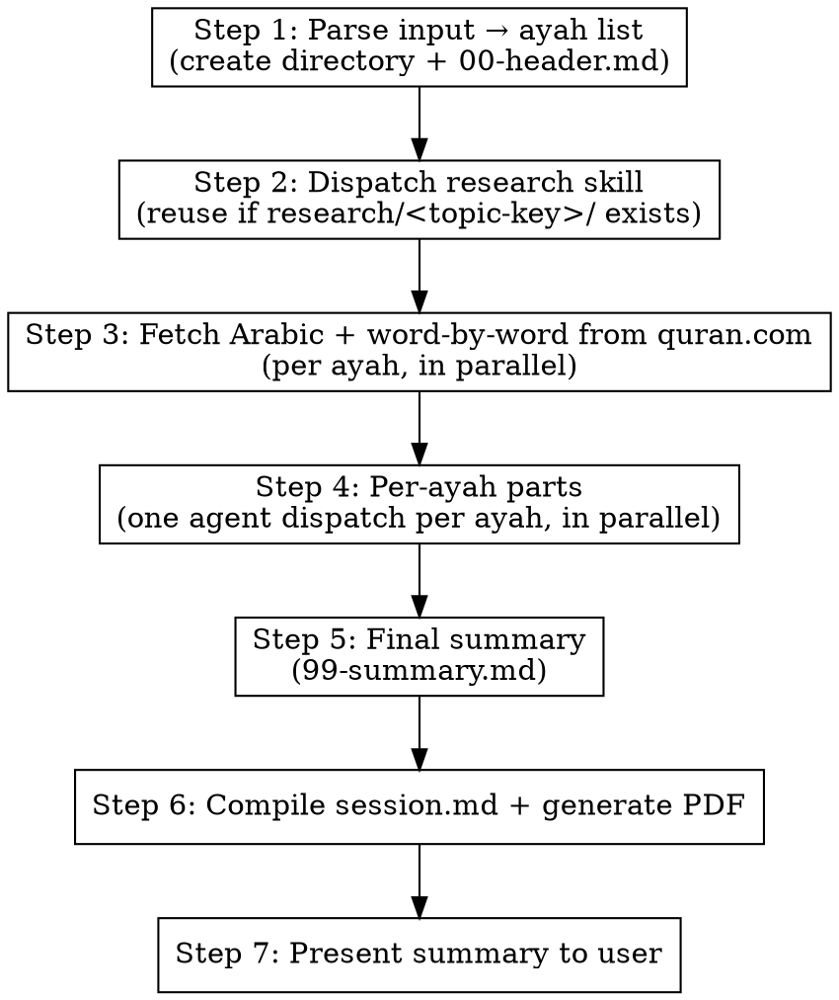

# Recite — Ayah-by-Ayah Structured Study Companion

## Overview

The `/recite` command produces a **textbook-style study guide** for any passage of the Quran. Unlike the other skills which take a *lens* on a passage:

- `/divine` — contemplative, layered theological reflection
- `/discover` — encyclopedic (hadith, scholars, science)
- `/tadabbur` — relentless investigative lecture in one voice
- `quran-explorer` — 9-stage deep dive on a single ayah

…`recite` is **structured, parallel, repetitive in form** — the same template applied uniformly to every ayah in the passage, then a single closing summary. It is meant for the student who wants to study or recite a whole section with consistent depth on every verse.

## What Recite IS NOT

**CRITICAL — read before producing any content:**

- Not a relentless "why this word, why not that" investigation — that is `/tadabbur`.
- Not a 7-layer contemplative reflection — that is `/divine`.
- Not an encyclopedic hadith/companion narration sweep — that is `/discover`.
- Not a dual-voice scholar dialogue — that was the deprecated old `recite`. **Do not reproduce it.**

`recite` is a **study guide**. Every ayah gets the same six fields, in the same order, with the same heading structure. Predictable, parallel, scannable.

## Input Format

The user provides one of:

- A specific ayah: `/recite 2:255` or `/recite Surah al-Baqarah ayah 255`
- A range: `/recite 2:255-257`, `/recite 36:1-12`
- A whole surah: `/recite Surah al-Ikhlas`, `/recite Surah 112`
- A named verse: `/recite Ayat al-Kursi`
- A named passage: `/recite the last 10 verses of al-Kahf`, `/recite the opening of al-Baqarah`

For ambiguous inputs, present 2-3 candidate resolutions and confirm with the user.

### Range cap (soft)

If the resolved passage is longer than **20 ayahs**, warn the user that the PDF will be long and the per-ayah depth may take significant time, then ask whether to proceed, split into batches, or limit to a subset. Proceed only after confirmation.

## Per-Ayah Template

This is the **fixed template** that every ayah part file must follow. Do not vary the order or skip sections — if a section has no content, write the section heading and one honest sentence stating why (e.g., "No specific sabab al-nuzul has been recorded for this ayah").

```markdown
## آیت <surah>:<ayah>

### عربی متن
[Arabic from quran.com — centered, RTL, large. Use blockquote.]

> [قرآن میں پڑھیں](https://quran.com/<surah>/<ayah>)

### لفظ بہ لفظ ترجمہ
| عربی | اردو نقل حرفی | لفظی معنی |
|------|--------------|----------|
| ...  | ...          | ...      |

### آسان اردو ترجمہ
[Single smooth Urdu translation. Default: *آسان ترجمۂ قرآن* — مفتی محمد تقی عثمانی۔ Cite the source line in Urdu only.]

### بنیادی الفاظ
- **<عربی root>** (ر-و-ت) — اردو میں معنوی میدان؛ یہاں اس کی اہمیت۔
- **<عربی root>** (ر-و-ت) — اردو میں معنوی میدان؛ یہاں اس کی اہمیت۔
- [3-5 most theologically loaded roots in this ayah]

### تفسیر
[ONE unified flowing paragraph in Urdu, synthesizing classical (طبری، قرطبی، ابن کثیر، رازی) and contemporary (نعمان علی خان، ڈاکٹر یاسر قاضی، شیخ عمر سلیمان، ڈاکٹر اسرار احمد) tafseers. Discuss: meaning, purpose, what the ayah describes, the event/argument it sits within. NO inline scholar names in English. NO bullet lists. Scholar names, if cited at all, must appear in Urdu transliteration only.]

### شانِ نزول
[When and why the ayah was revealed, in Urdu. Cite hadith with grading and sunnah.com link where applicable (hadith collection names in Urdu: بخاری، مسلم، ترمذی، ابو داؤد، نسائی، ابن ماجہ + رقم). If no specific sabab exists, state plainly in Urdu (e.g., "اس آیت کی کوئی صراحت سے روایت شدہ شانِ نزول دستیاب نہیں") and describe the broader Meccan/Medinan context instead.]

---
```

### Tafseer synthesis rules

- **One paragraph** per ayah. Not bullets. Not a comparison table.
- **No inline scholar names** ("Ibn Kathir says…", "Nouman explains…"). Synthesize all sources into a single flowing discussion. Scholar names belong only in the references section at the end.
- The paragraph must answer four implicit questions, in order: (1) what does the ayah mean? (2) what is its purpose? (3) what does it describe (a scene, an argument, a command)? (4) what event or surrounding argument does it sit within?
- Length: 200-400 words per ayah. Longer for famously dense ayahs (e.g., Ayat al-Kursi). Tighter for short Meccan ayahs.

### Root word rules

- Pick **3-5 roots per ayah**, no more. The most theologically/semantically loaded ones.
- Format: `**<Arabic root>** (letter-letter-letter)` — semantic field — why it matters in this specific ayah.
- Pull insights from Nouman Ali Khan / Taimiyyah Zubair transcripts where available.
- Do **not** turn this into a full lexical dump — that defeats the parallel-template format.

### Word-by-word table rules

- Cover **every word** of the ayah, in order.
- Use quran.com's word-by-word breakdown as the canonical source for segmentation.
- Three columns: Arabic word | **Urdu-script transliteration** | literal meaning (1-3 words in Urdu).
- The middle column (نقل حرفی) MUST be in Urdu script, NOT Roman/Latin script. Example: for `بِسْمِ` write `بسم` (not `Bismi`); for `اللّٰهِ` write `اللہ` (not `Allahi`).
- Keep it tight — this is a quick lookup, not a discussion.

## Final Summary

After all per-ayah parts, produce **one** closing summary file (`parts/99-summary.md`):

```markdown
## خلاصہ — <Urdu passage reference, e.g. سورۃ الفاتحہ>

### مجموعی معنی
[1-2 paragraphs in Urdu: what is the passage about, taken as a whole? What is its overall message?]

### کیا سکھاتا ہے
[1 paragraph in Urdu: the central lessons, framed as takeaways for the reader.]

### مقصد
[1 paragraph in Urdu: why was this passage revealed? What does it accomplish in the surah / in the Quran?]

### اسباب و واقعات
[1 paragraph in Urdu: the historical/Meccan/Medinan context, key revelation events, and how the ayahs in this passage relate to each other as a sequence.]
```

The summary should fit on **one page** in the final PDF (~400-600 words total). It is a synthesis of the ayah-level work above, not new material.

## Session Directory Structure

```
sessions/YYYY-MM-DD-recite-<topic-key>/
  parts/
    00-header.md                    # Title, date, passage reference, anchor link
    01-ayah-<surah>-<ayah>.md       # One file per ayah, numbered in passage order
    02-ayah-<surah>-<ayah>.md
    ...
    99-summary.md                   # Final passage-wide summary
  session.md                        # Compiled from all parts
  session.pdf                       # Final PDF
```

The directory name is prefixed `recite-` to distinguish from `divine-`/`discover-`/`tadabbur-` outputs on the same passage. The `<topic-key>` matches the canonical key used by the `research` skill (e.g., `al-baqarah-255-257`, `al-ikhlas-1-4`).

## Execution Flow



### Step 1: Parse input → ayah list

1. Resolve the user's input to a canonical passage key (use the `research` skill's normalization rules — surah slug + ayah numbers).
2. Enumerate the **explicit list** of ayahs the passage covers. A 20-ayah range becomes 20 entries; a whole surah becomes N entries where N is the ayah count of that surah.
3. If the passage exceeds **20 ayahs**, warn the user and ask before proceeding.
4. Create the session directory: `sessions/YYYY-MM-DD-recite-<topic-key>/parts/`.
5. Write `parts/00-header.md`:

```markdown
# تلاوت و مطالعہ: <Urdu passage name, e.g. سورۃ الفاتحہ>

**تاریخ:** YYYY-MM-DD
**نوعیت:** تلاوت — ساخت یافتہ آیت بہ آیت مطالعہ
**موضوع:** <Urdu surah/passage name only — e.g. سورۃ البقرہ، آیات ۲۵۵–۲۵۷>
**آیات:** <Arabic-numeral refs in Urdu form, e.g. ۲:۲۵۵، ۲:۲۵۶، ۲:۲۵۷>
**بنیادی حوالہ:** [قرآن میں پڑھیں](https://quran.com/<surah>)
**تحقیق:** research/<topic-key>/

---
```

**Header rules:**
- The H1 title and every label (`تاریخ`, `نوعیت`, `موضوع`, `آیات`, `بنیادی حوالہ`, `تحقیق`) MUST be Urdu. No `Recite`, no `Research:`, no `Surah al-Fatiha`, no `The Opening`.
- Surah names use Urdu script only (`سورۃ الفاتحہ`, `سورۃ البقرہ`, `سورۃ الاخلاص`). No Latin transliterations or English translations of the name.
- Allowlist: the URL in `بنیادی حوالہ`, and the filesystem path after `تحقیق:` (e.g. `research/al-baqarah-255-257/`).

6. Present the resolved ayah list to the user and confirm before proceeding.

### Step 2: Dispatch research skill

Call the `research` skill with:

- **Topic:** the passage reference
- **Topic key:** `<topic-key>` (canonical, slugified)
- **Needs:** transcripts, hadith-verification, scientific-research (current-events optional — recite uses it lightly)
- **Mode:** skill-called
- **Minimum transcripts:** 3 per scholar where available, 5 transcripts total minimum across all scholars

If `research/<topic-key>/` already exists and is sufficient, the research skill returns immediately and we reuse it.

### Step 3: Fetch Arabic + word-by-word from quran.com

For **each ayah** in the list, in parallel:

1. WebFetch `https://quran.com/<surah>/<ayah>` to get the Arabic text and the smooth Mustafa Khattab translation.
2. WebFetch the same page for the word-by-word breakdown (quran.com renders both inline). If the segmentation is unclear, fall back to `https://api.quran.com/api/v4/verses/by_key/<surah>:<ayah>?words=true&translations=131&fields=text_uthmani` (translation 131 = Khattab; field `text_uthmani` for Arabic).
3. Store the raw fetched data temporarily in memory or in `parts/.cache/<surah>-<ayah>.md` for the per-ayah agent to consume.

**Never fabricate Arabic, translation, or word breakdown.** If a fetch fails, retry once; if it still fails, surface the failure to the user and pause that ayah.

### Step 4: Per-ayah parts (parallel agents)

For each ayah, dispatch a subagent that writes `parts/NN-ayah-<surah>-<ayah>.md` (where NN is the ayah's order within the passage, zero-padded — `01`, `02`, …).

**Each agent must read:**

- The cached Arabic + word-by-word + Khattab translation for this ayah.
- All `.txt` files in `research/<topic-key>/transcripts/` — mining for tafseer insights, root word explanations, and asbab al-nuzul references for THIS specific ayah.
- `research/<topic-key>/web/hadith-verification.md` — for sabab al-nuzul hadith.
- `research/<topic-key>/web/scientific-research.md` only if the ayah references a natural phenomenon, creature, or scientific concept (most ayahs will not need this).

**Each agent prompt must include:**

- The full **Per-Ayah Template** section from this skill (copied verbatim).
- The full **Tafseer synthesis rules**, **Root word rules**, and **Word-by-word table rules**.
- The full **What Recite IS NOT** section.
- The specific ayah reference, the cached Arabic, the Khattab translation, and the word-by-word data fetched in Step 3.
- Explicit instruction: "Produce ONE flowing tafseer paragraph. No inline scholar names. No bullet lists in the tafseer. Pick 3-5 roots only."
- Explicit instruction: "Use WebSearch + sunnah.com to verify any sabab al-nuzul hadith you cite, with the grading."
- Explicit instruction: "The middle column of the word-by-word table (نقل حرفی) MUST be in Urdu script, never in Roman/Latin script. Example: write `بسم`, not `Bismi`."
- Explicit instruction: "**Language gate before saving:** scan the file for any A–Z Latin runs of length ≥ 3. If any are found outside the allowlist (URLs, file paths, hadith ref numbers in parens), rewrite in Urdu and re-scan. Only save once the file is clean. In particular: NO English headings, NO English parentheticals like `(Root Words)` / `(Asbab al-Nuzul)` / `(Mufti Taqi Usmani)`, NO English scholar names in body prose."

Agents run **in parallel** — there is no inter-ayah dependency, since each ayah part is self-contained by design.

### Step 5: Final summary

After all per-ayah parts are written, dispatch one summary agent to write `parts/99-summary.md`.

**Summary agent must read:** all `parts/NN-ayah-*.md` files written in Step 4, plus `parts/00-header.md`.

**Agent prompt must include:**

- The full **Final Summary** section (template copied verbatim).
- Explicit instruction: "Synthesize the ayah-level material above. Do NOT introduce new tafseer or hadith. The summary is a one-page distillation, ~400-600 words total."
- Explicit instruction: "Cover all four sub-sections: مجموعی معنی, کیا سکھاتا ہے, مقصد, اسباب و واقعات. Headings MUST be Urdu only — no English parentheticals like `(What it teaches us)` / `(Purpose)` / `(Causes and surrounding events)`."
- Explicit instruction: "**Language gate before saving:** scan the file for any A–Z Latin runs of length ≥ 3. If any are found outside the allowlist (URLs, file paths, hadith ref numbers in parens), rewrite in Urdu and re-scan. Only save once the file is clean."

### Step 6: Compile and generate PDF

1. **Compile** all parts in numeric order into `sessions/YYYY-MM-DD-recite-<topic-key>/session.md`:

```bash
cat parts/00-header.md > session.md
echo "" >> session.md
for f in parts/[0-9][0-9]-ayah-*.md; do
  cat "$f" >> session.md
  echo "" >> session.md
done
cat parts/99-summary.md >> session.md
```

2. **Generate PDF** using the `md-to-pdf` skill:

```bash
node .claude/skills/md-to-pdf/convert.mjs sessions/YYYY-MM-DD-recite-<topic-key>/session.md
```

### Step 7: Present summary to user

After PDF generation, report to the user:

1. Number of ayahs covered.
2. The directory path: `sessions/YYYY-MM-DD-recite-<topic-key>/`.
3. The PDF path: `sessions/YYYY-MM-DD-recite-<topic-key>/session.pdf`.
4. The number of unique roots analyzed across the passage.
5. Whether `research/<topic-key>/` was newly fetched or reused.

## Language Enforcement (HARD GATE)

**The entire user-facing output is in Urdu. This is non-negotiable.** Headings, sub-headings, metadata labels, narrative prose, transliteration column, root explanations, tafseer paragraphs, شانِ نزول, and the final summary — all in Urdu script. Arabic ayah text stays in Arabic (Uthmani script from quran.com); that is not English.

**Banned in user-facing output:**
- English headings or sub-headings of any kind.
- English parentheticals after Urdu headings. **Do NOT** write `(Root Words)`, `(Asbab al-Nuzul)`, `(Mufti Taqi Usmani)`, `(What it teaches us)`, `(Purpose)`, `(Causes and surrounding events)`, etc. The Urdu heading stands alone.
- English scholar names in body prose. Use Urdu transliteration only — مفتی محمد تقی عثمانی، نعمان علی خان، ڈاکٹر اسرار احمد، ڈاکٹر یاسر قاضی، شیخ عمر سلیمان، مفتی منک، طبری، قرطبی، ابن کثیر، رازی، استاذہ تیمیۃ زبیر۔
- English metadata labels like `Research:`, `Date:`, `Topic:`, `Recite —`. Use Urdu (`تحقیق:`, `تاریخ:`, `موضوع:`, `تلاوت —`).
- English surah names like `Surah al-Fatiha`, `The Opening`. Use Urdu (`سورۃ الفاتحہ`).
- Roman / Latin-script transliteration in the word-by-word table. The middle column MUST be Urdu script (`بسم`, `اللہ`), not Roman (`Bismi`, `Allahi`).
- Inventing English subtitle clarifiers in any heading.

**Allowlist — these MAY remain in Latin script:**
- URLs: `https://quran.com/...`, `https://sunnah.com/...`, etc.
- Filesystem paths inside metadata: `research/al-baqarah-255-257/`, `parts/`, `session.md`.
- Markdown link syntax / file extensions (`.md`, `.pdf`).

**Hadith citations:** prefer Urdu form (`بخاری ۴۷۰۴`, `صحیح مسلم ۳۹۵`). If a Roman-script hadith ref appears inside parenthetical citation only (e.g. `(Sahih al-Bukhari 4704)`), it is tolerated but the Urdu form is preferred.

**Self-check before saving any part file:** scan the draft for any A–Z Latin character runs of length ≥ 3 outside the allowlist. If any are found (e.g. `Root Words`, `Mufti Taqi Usmani`, `Asbab al-Nuzul`, `Surah`, `Research`, `Recite`, `Bismi`, `Allahi`), rewrite in Urdu and re-scan. Only save once the file is clean.

**Sources & verification:**
- Use WebSearch and WebFetch to verify references from quran.com (with Urdu translations enabled), sunnah.com, altafsir.com, islamweb.net.
- Default smooth translation: *آسان ترجمۂ قرآن* by **مفتی محمد تقی عثمانی**. If the user requests another Urdu translation (Fateh Muhammad Jalandhari, Maududi Tafhim, Ahsan-ul-Bayan, etc.), honor that — but never default to English.
- For each ayah, fetch the Urdu translation from quran.com using Mufti Taqi Usmani's translation ID (158) — e.g., `https://api.quran.com/api/v4/quran/translations/158?chapter_number=<surah>` — or by selecting Urdu (Mufti Taqi Usmani) on quran.com's verse page.
- **Never fabricate** Arabic, Urdu translations, hadith, tafseer quotes, or scholarly opinions. When uncertain, state the limitation in Urdu.

## Adaptive Length Guidelines

Recite scales **predictably** by passage length, since each ayah gets a fixed-shape part:

- **1 ayah:** ~250-350 lines total (ayah part + summary).
- **3-5 ayahs:** ~600-1000 lines total.
- **10 ayahs:** ~1500-2000 lines total.
- **20 ayahs:** ~3000-4000 lines total — warn the user before starting.

Each per-ayah part should target **150-250 lines** of markdown (Arabic + table + translation + roots + tafseer + asbab). The summary is always one page (~80-120 lines).

## Important Notes

- The **parallel template structure** is the entire point of this skill. If you find yourself varying the per-ayah format ayah-to-ayah ("this ayah deserves a section the others don't"), stop — that varied depth belongs in `/quran-explorer` or `/tadabbur`, not here.
- Per-ayah agents run in parallel. They do **not** read each other's output. This is intentional — each ayah is treated as a standalone entry. Cross-ayah connections are handled in the final summary.
- If a sabab al-nuzul hadith cannot be verified on sunnah.com, do **not** cite it. Say "no specific sabab al-nuzul has been authentically recorded for this ayah" instead of inventing one.
- Always confirm the resolved ayah list with the user before dispatching parallel agents — once research is fetched and N agents are running, the cost of a wrong scope is high.
