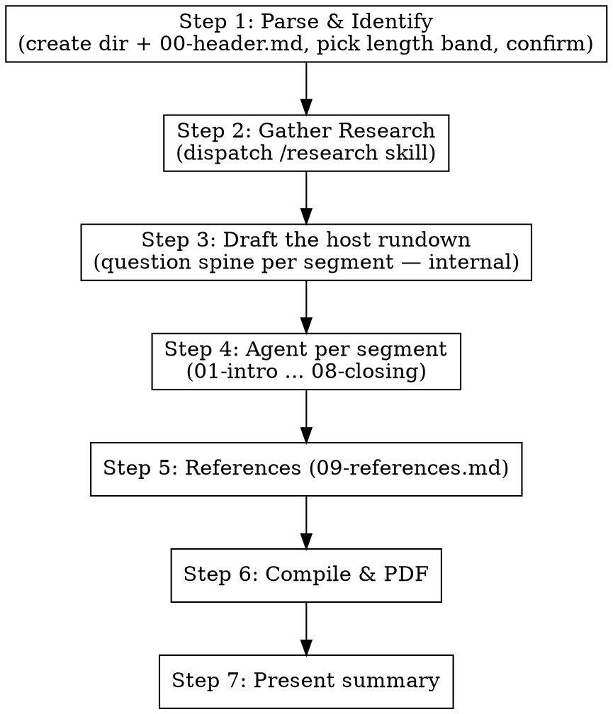

# /podcast Skill Implementation Plan

> **For agentic workers:** REQUIRED SUB-SKILL: Use superpowers:subagent-driven-development (recommended) or superpowers:executing-plans to implement this plan task-by-task. Steps use checkbox (`- [ ]`) syntax for tracking.

**Goal:** Add a local `/podcast` skill that generates a long-form (1–3 hr) simple-Urdu podcast transcript — a host interviewing two complementary virtual Aalims — compiled to PDF.

**Architecture:** A single `.claude/skills/podcast/SKILL.md` defines the skill (cast, authenticity rule, 10-segment episode structure, length bands, voice rules, and a segment-per-agent execution pipeline modeled on `/tadabbur`). The orchestrator parses the topic, dispatches `/research`, drafts a host "rundown," dispatches one agent per segment, then compiles parts → `session.md` → `session.pdf` via the existing `md-to-pdf` skill. The command is registered in `CLAUDE.md`.

**Tech Stack:** Markdown skill definition; existing `/research` skill; `node .claude/skills/md-to-pdf/convert.mjs`; WebSearch for verification. No code, no test framework — verification is structural (frontmatter validity + section/registration grep checks). Spec: `docs/superpowers/specs/2026-05-29-podcast-skill-design.md`.

**Convention note:** Every skill in this repo is a single `SKILL.md` (confirmed: `.claude/skills/*/SKILL.md`). Tasks 1–5 append sequential sections to that one file; Task 6 registers the command; Task 7 is a final structural + manual check.

---

### Task 1: Scaffold SKILL.md — frontmatter, overview, cast, authenticity rule

**Files:**
- Create: `.claude/skills/podcast/SKILL.md`

- [ ] **Step 1: Create the file with frontmatter + opening sections**

Write `.claude/skills/podcast/SKILL.md` with exactly this content:

````markdown
---
name: podcast
description: Use when the user invokes /podcast with any Quranic ayah or range, hadith, Islamic event, act/practice, concept, or theme. Produces a long-form Urdu podcast transcript — a host (میزبان: طالبِ علم) interviews two virtual Aalims (عالمِ اصول — classical Quran/hadith/history lens; عالمِ عصر — contemporary application + myth-busting lens) across the authentic Quran/hadith foundation, deep dual-level knowledge, historical journey, modern application, false-but-popular beliefs, and emergent Q&A — all in simple, conversational Urdu, scaled to a 1–3 hour episode, compiled into a PDF.
---

# Podcast — Conversational Scholarly Podcast (پوڈکاسٹ)

## Overview

The `/podcast` command produces a long-form **Urdu podcast transcript** (compiled to PDF) of a
recurring scholarly show. A host — **میزبان: طالبِ علم (the Knowledge Seeker)** — interviews
**two virtual Aalims** about any topic: an event, an act/practice, a hadith, an ayah or range of
ayat, an Islamic concept, or any related theme.

One episode takes the listener from zero to **near-complete understanding**: the authentic basis in
Quran and authentic hadith, deep knowledge at both beginner and advanced levels, the topic's
historical journey, how it applies in this era, the false-but-popular beliefs people wrongly
attribute to Islam, and the natural follow-up questions that arise from the discussion.

The transcript reads like a real 1–3 hour audio/video podcast — but the language is **strictly
simple, conversational Urdu** throughout, even when the content is advanced.

## What this skill is NOT

- **Not** a single-voice lecture (that is `/tadabbur`).
- **Not** an academic ayah-by-ayah study guide (that is `/recite`).
- **Not** an encyclopedic fact dump (that is `/discover`).
- It is a **two-guest interview**, driven by a relentless, curious, plain-spoken host. If a section
  starts reading like an essay or a monologue, STOP and return to question-and-answer dialogue.

## The Cast (recurring across all episodes)

| Role | Label (Urdu) | Lens |
|------|--------------|------|
| Host | **میزبان: طالبِ علم** | The Knowledge Seeker. Drives the conversation with what / why / how / when across every field (linguistic, historical, fiqh, spiritual, scientific, social, contemporary). Asks the simple questions a beginner would AND the sharp ones an advanced listener would. Never lectures — always asks, follows up, and pulls threads out of the answers. |
| Aalim 1 | **عالمِ اصول** | Classical lens: Quran, tafseer, hadith sciences + narrator chains, authentic Islamic history. Grounds everything in primary texts. |
| Aalim 2 | **عالمِ عصر** | Contemporary lens: applying the topic today, real modern situations, and debunking false-but-popular beliefs. |

**Cast rules:**
- Both Aalims have **full knowledge**; the lenses divide *emphasis*, not capability.
- Use the descriptive title-personas above — **never invent personal names** for the Aalims and
  never impersonate a real, named living or historical scholar.
- The cast is **recurring** — keep the same labels every episode so it feels like a real series.
- Where real scholars genuinely differ, the Aalims present that **ikhtilaf** respectfully and
  clearly labelled. Never manufacture disagreement; never contradict established consensus (ijماع).

## The Hard Authenticity Rule (the spine of this skill)

The personas are a **teaching frame**. Every fact stated by any character must be **real and
sourced**. This rule overrides conversational style whenever they conflict.

- Hadith are cited with **source AND grade** (صحیح / حسن / ضعیف / موضوع).
- Ayat link to quran.com; hadith link to sunnah.com.
- Real scholarly opinions are **attributed to the real scholar** who holds them, verified via
  WebSearch. (Unlike `/tadabbur`, attribution is *required* here.)
- **Never fabricate** a hadith, tafseer quote, scholarly opinion, or historical claim.
- When a reference is uncertain or disputed, an Aalim says so openly, in character
  (e.g. «اس بارے میں روایات مختلف ہیں…» or «یہ روایت سنداً کمزور ہے، اس لیے اس پر عقیدہ نہیں بنایا جا سکتا»).
- The myth-busting segment (06) leans hardest on this rule: every "false concept" must be shown to
  be absent from — or contradicted by — authentic sources, with the authentic position cited.
````

- [ ] **Step 2: Verify the file exists and frontmatter is valid**

Run: `head -5 .claude/skills/podcast/SKILL.md`
Expected: lines begin with `---`, then `name: podcast`, then a `description:` line, then `---`.

- [ ] **Step 3: Verify the opening sections are present**

Run: `grep -c -E "^## (Overview|What this skill is NOT|The Cast|The Hard Authenticity Rule)" .claude/skills/podcast/SKILL.md`
Expected: `4`

- [ ] **Step 4: Commit**

```bash
git add .claude/skills/podcast/SKILL.md
git commit -m "feat(podcast): scaffold skill with cast and authenticity rule"
```

---

### Task 2: Add input format + the 10-part episode structure

**Files:**
- Modify: `.claude/skills/podcast/SKILL.md` (append)

- [ ] **Step 1: Append the input + episode-structure sections**

Append this content to `.claude/skills/podcast/SKILL.md`:

````markdown

## Input Format

The user provides one of:
- A specific ayah or range: `/podcast 2:255` or `/podcast 103:1-3`
- A surah: `/podcast Surah Al-Asr`
- A named verse: `/podcast Ayat al-Kursi`
- A hadith: `/podcast hadith of Jibril` / `/podcast hadith on intentions`
- An event: `/podcast Hijrah` / `/podcast Battle of Badr`
- An act/practice: `/podcast wudu` / `/podcast tawakkul` / `/podcast sadaqah`
- A concept or theme: `/podcast the concept of rizq` / `/podcast patience in the Quran`

For ambiguous or very broad input, identify 2–3 possible angles and the anchor reference(s) that
would ground the episode, and confirm with the user before proceeding.

## Episode Structure — The 10 Parts

Each part is a separate `parts/NN-*.md` file, written by its own agent, then compiled in order.
Percentages are share of total transcript length.

### Part 00 — Header (`00-header.md`)
Meta only (see template in Execution Flow). Episode title, date, topic, anchor reference, research
key, and a one-line intro of the recurring cast.

### Part 01 — تعارف (`01-intro.md`) · ~5%
**Host opens the show.** Warm, simple opening; names the show and the cast; states today's topic and
*why it matters to an ordinary listener*; teases the questions the episode will answer. Ends with the
host turning to the Aalims with the first real question. Pure dialogue.

### Part 02 — قرآن و حدیث میں اصل بنیاد (`02-foundation.md`) · ~12%
**The verified textual foundation.** Host asks: «اس کی اصل بنیاد قرآن اور حدیث میں کہاں ہے؟»
عالمِ اصول lays out the relevant ayat (linked to quran.com) and the authentic hadith (with source +
grade). عالمِ عصر translates each into plain meaning for the listener. Establish what is *definitely*
established from the primary texts before any nuance.

### Part 03 — گہرائی: آسان + عمیق دونوں سطح (`03-depth.md`) · ~30% (LONGEST)
**The deep dive at BOTH levels.** This is the heart of the episode and must be the longest segment.
The host repeatedly asks for "first the simple version, then the deep version." Cover, as the topic
demands: key Arabic words/roots (explained simply), asbab al-nuzul / context, fiqh rulings and the
range of authentic scholarly opinion (ikhtilaf, attributed to real scholars), spiritual/heart
dimension, and any sound scientific/psychological angle. Every advanced point is immediately
re-explained in beginner terms by the host or عالمِ عصر. Keep it as dialogue — host pulls each thread.

### Part 04 — تاریخی سفر (`04-history.md`) · ~13%
**The historical journey, authentically traced.** Prophetic era → the Companions → later Islamic
history → how understanding/practice developed. عالمِ اصول leads with verified history; host keeps
asking «پھر کیا ہوا؟ / یہ ہمیں کیسے معلوم ہے؟». Flag any popular-but-unverified historical story as
such rather than repeating it as fact.

### Part 05 — آج کے دور میں (`05-today.md`) · ~13%
**Application in this era.** عالمِ عصر leads. How does this live in a modern Muslim's life — work,
family, phone, money, society? Tie to real current situations (use the current-events research).
Host asks «اکیسویں صدی میں اس کا کیا مطلب ہے؟ ایک عام نوجوان اس پر کیسے عمل کرے؟».

### Part 06 — غلط فہمیاں اور بدعات (`06-myths.md`) · ~13%
**Myth-busting.** Host asks «لوگ اس بارے میں کیا غلط سمجھتے ہیں؟» The Aalims list beliefs/practices
people attribute to Islam that are **not** in the Quran or authentic hadith — cultural add-ons, weak
or fabricated narrations, common misunderstandings — and for each: state the popular belief, show why
it is not authentic (with evidence), then state the authentic position (with source). This segment
applies the Hard Authenticity Rule most strictly.

### Part 07 — ابھرتے ہوئے سوالات (`07-emergent-qa.md`) · ~8%
**The questions that arise from the discussion.** Faster Q&A. The host raises the follow-ups a sharp
listener would now have after everything said — edge cases, "but what about…", apparent
contradictions resolved, practical "how exactly do I do this." Goal: by the end, the listener has
*near-complete* understanding with no obvious open question left dangling.

### Part 08 — اختتامیہ و خلاصہ (`08-closing.md`) · ~5%
**Wrap-up.** Host summarizes the journey in plain words; each Aalim gives 1–2 key takeaways; a short
authentic closing dua. Host thanks the guests and signs off the show.

### Part 09 — حوالہ جات (`09-references.md`)
**References.** All ayat (quran.com links), all hadith (sunnah.com links + grade), scholars cited,
and web sources used across the episode. (Format template in Execution Flow.)
````

- [ ] **Step 2: Verify all ten parts are documented**

Run: `grep -c -E "^### Part 0[0-9]" .claude/skills/podcast/SKILL.md`
Expected: `10`

- [ ] **Step 3: Verify the Input Format section is present**

Run: `grep -c -E "^## Input Format" .claude/skills/podcast/SKILL.md`
Expected: `1`

- [ ] **Step 4: Commit**

```bash
git add .claude/skills/podcast/SKILL.md
git commit -m "feat(podcast): add input format and 10-part episode structure"
```

---

### Task 3: Add length guidance and voice/language rules

**Files:**
- Modify: `.claude/skills/podcast/SKILL.md` (append)

- [ ] **Step 1: Append length + voice sections**

Append this content to `.claude/skills/podcast/SKILL.md`:

````markdown

## Length Guidance (simulating a real 1–3 hour podcast)

Pick a band from the parsed topic's breadth. Targets are **word-count floors** mapped to spoken
minutes at ~130 words/min for Urdu. Part 03 always carries the largest single share (~30%).

| Topic breadth | Target | ≈ Words (floor) |
|---------------|--------|-----------------|
| Narrow — single ayah / single hadith / one act | ~1 hr | ≈ 8,000–10,000 |
| Medium — ayah range / focused concept | ~1.5–2 hr | ≈ 13,000–18,000 |
| Broad — event / large theme / surah | up to 3 hr | ≈ 22,000–27,000 |

Each segment agent is told its **word-count floor** (its percentage share × the chosen total) so the
compiled transcript actually reaches the target. If unsure of the band, confirm with the user at
parse time.

## Voice & Language

- **Strictly simple, conversational Urdu.** Even "high-level" content is made beginner-accessible;
  every technical term (Arabic, fiqh, hadith-science) is explained on first use, in dialogue.
- **Speaker labels** in bold, exactly: `**میزبان:**`, `**عالمِ اصول:**`, `**عالمِ عصر:**`.
- **Natural turn-taking** — questions, follow-ups, «ذرا رکیے، یہ سمجھائیے…», building on each other.
  No long uninterrupted monologues; the host breaks them up.
- The host covers **all levels and all fields** and keeps returning to «کیا، کیوں، کیسے، کب».
- **Do not embed Arabic ayah text** — link to quran.com (e.g. `[آیت پڑھیں](https://quran.com/2/255)`).
  Keep Arabic terms, transliterations, scholar names, book titles, and URLs in original form.
````

- [ ] **Step 2: Verify both sections present**

Run: `grep -c -E "^## (Length Guidance|Voice & Language)" .claude/skills/podcast/SKILL.md`
Expected: `2`

- [ ] **Step 3: Commit**

```bash
git add .claude/skills/podcast/SKILL.md
git commit -m "feat(podcast): add length bands and voice/language rules"
```

---

### Task 4: Add session structure + execution flow + format rules

**Files:**
- Modify: `.claude/skills/podcast/SKILL.md` (append)

- [ ] **Step 1: Append the session structure, execution flow, and standard rules**

Append this content to `.claude/skills/podcast/SKILL.md`:

````markdown

## Session Directory Structure

```
sessions/YYYY-MM-DD-podcast-[name]/
  parts/
    00-header.md
    01-intro.md
    02-foundation.md
    03-depth.md
    04-history.md
    05-today.md
    06-myths.md
    07-emergent-qa.md
    08-closing.md
    09-references.md
  session.md          ← compiled from all parts
  session.pdf         ← final PDF
```

## Execution Flow



### Step 1: Parse and Identify
- Resolve the input to a clear subject + anchor reference(s). For ambiguous/broad input, present
  2–3 angles and confirm with the user.
- Pick the length band (Length Guidance) and confirm if unsure.
- Create `sessions/YYYY-MM-DD-podcast-[name]/parts/` and write `parts/00-header.md`:

```markdown
# پوڈکاسٹ: [موضوع کا نام]

**تاریخ:** YYYY-MM-DD
**نوعیت:** پوڈکاسٹ — میزبان اور دو علماء کی گفتگو
**موضوع:** [موضوع کی تفصیل]
**بنیادی حوالہ:** [quran.com یا sunnah.com link]
**Research:** research/<topic-key>/

**شرکاء:**
- **میزبان: طالبِ علم** — سوالات کرنے والا
- **عالمِ اصول** — قرآن، تفسیر، حدیث و تاریخ کا ماہر
- **عالمِ عصر** — عصری اطلاق اور غلط فہمیوں کی اصلاح کا ماہر

---
```

- Present the topic, anchor reference, and chosen length band to the user before proceeding.

### Step 2: Gather Research
Dispatch the `/research` skill:
- **Topic:** [topic from Step 1]
- **Needs:** transcripts, current-events, hadith-verification, scientific-research
- **Mode:** skill-called
- **Minimum transcripts:** 3

Reuse `research/<topic-key>/` if it already exists and is sufficient. Mine transcripts for authentic
hadith, real scholarly opinions (with names), historical detail, and common misconceptions to debunk.

### Step 3: Draft the Host Rundown
Before dispatching segment agents, draft the host's **question spine** — the actual `میزبان` questions
for each of parts 01–08 (this realizes "the host has all the questions"). This is internal working
material passed into each segment agent's prompt; it is NOT a separate output file. Include
what/why/how/when questions at both beginner and advanced levels, plus the specific myths to test in
Part 06.

### Step 4: Dispatch one agent per segment (01 → 08)
Dispatch sequentially. Each agent:
- **Must read** the prior compiled parts (for continuity of what's already been said) and the relevant
  `research/<topic-key>/` files: all transcripts for every segment; additionally
  `web/hadith-verification.md` for 02/03/06, `web/scientific-research.md` for 03/05,
  `web/current-events.md` for 05.
- **Must be given in its prompt:** the Cast section, the Hard Authenticity Rule, the Voice & Language
  rules, its Part brief + percentage share, its **word-count floor**, and its slice of the rundown.
- **Writes** only its `parts/NN-*.md`, as pure speaker-labelled dialogue (no narration/essay).

Segment-specific reminders to include:
- 02/03/06: every hadith needs source + grade; attribute opinions to real scholars; verify with WebSearch.
- 06: for each myth — popular belief → why not authentic (evidence) → the authentic position (source).
- 03: must be the longest; every advanced point re-explained simply.

### Step 5: References
Dispatch an agent to read all parts and compile `parts/09-references.md`:

```markdown
---

## حوالہ جات

### قرآنی حوالے
- [each cross-referenced ayah with quran.com link]

### احادیث (درجہ بندی کے ساتھ)
- [each hadith with sunnah.com link and grade — صحیح/حسن/ضعیف/موضوع]

### علماء کی آراء
- [each named scholar whose opinion was cited]

### ویب مصادر
- [web sources used]
```

### Step 6: Compile and Generate PDF
1. Compile parts in order into `session.md`:

```bash
cd sessions/YYYY-MM-DD-podcast-[name]
cat parts/00-header.md parts/01-intro.md parts/02-foundation.md parts/03-depth.md \
    parts/04-history.md parts/05-today.md parts/06-myths.md parts/07-emergent-qa.md \
    parts/08-closing.md parts/09-references.md > session.md
```

2. Generate the PDF with the md-to-pdf skill:

```bash
node .claude/skills/md-to-pdf/convert.mjs sessions/YYYY-MM-DD-podcast-[name]/session.md
```

### Step 7: Present Summary
Give the user: the episode title, the central question the episode answered, the most striking myth
debunked in Part 06, the counts of ayat / hadith / scholars referenced, the chosen length band, and
the directory + `session.pdf` paths.

## Language and Format Rules

- **All output must be in simple, conversational Urdu** (Arabic ayah text excepted — it is linked, not embedded).
- Keep Arabic Islamic terms, transliterations, scholar names, book titles, and URLs in original form.
- Use WebSearch / WebFetch to verify references from sunnah.com, quran.com, altafsir.com, islamweb.net.
- Never fabricate quotes, hadith, references, or scholarly opinions. When uncertain, state the limitation in-character.

## Important Notes

- Each segment agent **must read** its specified prior parts + research files — do not skip this.
- The recurring cast labels must stay identical across parts and across episodes.
- Part 03 (گہرائی) must be the longest and most content-dense segment.
- The Hard Authenticity Rule overrides conversational flair whenever they conflict — especially in Part 06.
- If any agent fails, its part file will be missing — check before compiling.
- The final PDF should read like the transcript of the most useful podcast episode a listener has heard on the topic — simple enough for a beginner, deep enough for a student.
````

- [ ] **Step 2: Verify the execution sections are present**

Run: `grep -c -E "^## (Session Directory Structure|Execution Flow|Language and Format Rules|Important Notes)" .claude/skills/podcast/SKILL.md`
Expected: `4`

- [ ] **Step 3: Verify the compile command lists all 10 parts**

Run: `grep -o -E "parts/0[0-9]-[a-z-]+\.md" .claude/skills/podcast/SKILL.md | sort -u | wc -l | tr -d ' '`
Expected: `10`

- [ ] **Step 4: Commit**

```bash
git add .claude/skills/podcast/SKILL.md
git commit -m "feat(podcast): add session structure, execution flow, and format rules"
```

---

### Task 5: Register /podcast in CLAUDE.md

**Files:**
- Modify: `CLAUDE.md` (Commands list + Skills list)

- [ ] **Step 1: Add the command bullet to the Commands list**

In `CLAUDE.md`, under `## Commands`, immediately after the `/quran-deep-research` bullet, add:

```markdown
- `/podcast [topic]` — Long-form Urdu podcast transcript: a host (طالبِ علم) interviews two virtual Aalims — عالمِ اصول (classical Quran/hadith/history) and عالمِ عصر (contemporary application + myth-busting) — across authentic foundation, dual-level deep knowledge, historical journey, modern relevance, false-but-popular beliefs, and emergent Q&A. Simple Urdu, scaled to a 1–3 hour episode, compiled into a PDF.
```

- [ ] **Step 2: Add the skill bullet to the Skills list**

In `CLAUDE.md`, under `## Skills`, immediately after the `quran-deep-research` bullet, add:

```markdown
- `podcast` — Conversational scholarly podcast: recurring cast (host طالبِ علم + two complementary Aalims) over a 10-segment episode (intro → Quran/hadith foundation → dual-level deep dive → historical journey → modern application → myth-busting → emergent Q&A → closing → references). Strictly simple Urdu, 1–3 hour length bands, segment-per-agent pipeline reusing the shared `research/` library, compiled to PDF.
```

- [ ] **Step 3: Verify both registrations exist**

Run: `grep -c "podcast" CLAUDE.md`
Expected: `2` or more (at least the Commands bullet and the Skills bullet).

Run: `grep -n -E "^- \`/podcast|^- \`podcast\`" CLAUDE.md`
Expected: two matching lines — one `/podcast [topic]` under Commands, one `` `podcast` `` under Skills.

- [ ] **Step 4: Commit**

```bash
git add CLAUDE.md
git commit -m "docs: register /podcast command and skill in CLAUDE.md"
```

---

### Task 6: Final structural validation + manual run note

**Files:** (no edits — verification only)

- [ ] **Step 1: Confirm frontmatter parses and required keys exist**

Run: `awk 'NR==1{if($0!="---")exit 1} /^name: podcast$/{n=1} /^description:/{d=1} END{exit (n&&d)?0:1}' .claude/skills/podcast/SKILL.md && echo OK`
Expected: `OK`

- [ ] **Step 2: Confirm the full section inventory of SKILL.md**

Run: `grep -E "^## " .claude/skills/podcast/SKILL.md`
Expected (in order): Overview; What this skill is NOT; The Cast (recurring across all episodes); The Hard Authenticity Rule (the spine of this skill); Input Format; Episode Structure — The 10 Parts; Length Guidance (simulating a real 1–3 hour podcast); Voice & Language; Session Directory Structure; Execution Flow; Language and Format Rules; Important Notes.

- [ ] **Step 3: Sanity-check the md-to-pdf entry point referenced by the skill actually exists**

Run: `test -f .claude/skills/md-to-pdf/convert.mjs && echo "md-to-pdf OK"`
Expected: `md-to-pdf OK`

- [ ] **Step 4: Manual end-to-end check (requires the user)**

The skill cannot be auto-run from this plan because a real episode dispatches `/research`, multiple
segment agents, WebSearch verification, and the PDF build. After implementation, the user (or
orchestrator) should run a smoke episode on a **narrow** topic — e.g. `/podcast Surah Al-Asr` — and
confirm: the session directory + all 10 part files are created, `session.md` compiles, `session.pdf`
renders with correct Urdu/RTL, the transcript is dialogue with the three cast labels, every hadith
carries a grade, and Part 06 cleanly separates myth from authentic teaching. Note this is expected to
consume research + agent time/tokens.

- [ ] **Step 5: No commit** (verification-only task).

---

## Self-Review

**Spec coverage** (against `docs/superpowers/specs/2026-05-29-podcast-skill-design.md`):
- §1 Purpose / what-it-is-NOT → Task 1 (Overview, What this skill is NOT). ✓
- §2 Cast (host + two complementary Aalims, title-personas, recurring, ikhtilaf) → Task 1 (The Cast). ✓
- §3 Hard Authenticity Rule (grades, attribution, no fabrication, uncertainty disclosure) → Task 1 + reinforced in Tasks 2/4. ✓
- §4 Episode structure (10 parts) → Task 2. ✓
- §5 Length bands (1/2/3 hr word floors, Part 03 largest) → Task 3. ✓
- §6 Voice & language (simple Urdu, speaker labels, quran.com linking) → Task 3. ✓
- §7 Mechanics (parse → research → rundown → per-segment agents → references → compile → PDF → summary; session dir; registration) → Task 4 + Task 5. ✓
- §8 Success criteria → exercised by Task 6 (structural) + manual run note. ✓
- §9 Out of scope (no audio, no names, reuse research, no md-to-pdf changes) → honored; no task touches md-to-pdf or adds TTS. ✓

**Placeholder scan:** No TBD/TODO. `[topic]`, `[name]`, `<topic-key>`, `YYYY-MM-DD`, `[موضوع کا نام]` are intentional runtime templating tokens, mirroring the existing `/tadabbur` skill — not plan gaps.

**Type/name consistency:** Part filenames are identical across the structure table (Task 2), the session tree, the compile `cat` command, and the references step (Task 4): `00-header, 01-intro, 02-foundation, 03-depth, 04-history, 05-today, 06-myths, 07-emergent-qa, 08-closing, 09-references`. Cast labels identical everywhere: `میزبان: طالبِ علم`, `عالمِ اصول`, `عالمِ عصر`. The verify grep in Task 4 Step 3 expects 10 unique `parts/NN-*.md` names, matching.

**Commit-policy note:** Per the user's global CLAUDE.md ("commit only when the user asks; branch first if on the default branch"), the executor should confirm with the user before running the `git commit` steps, and branch off `main` first if commits are wanted. The steps are written assuming commits are approved.
