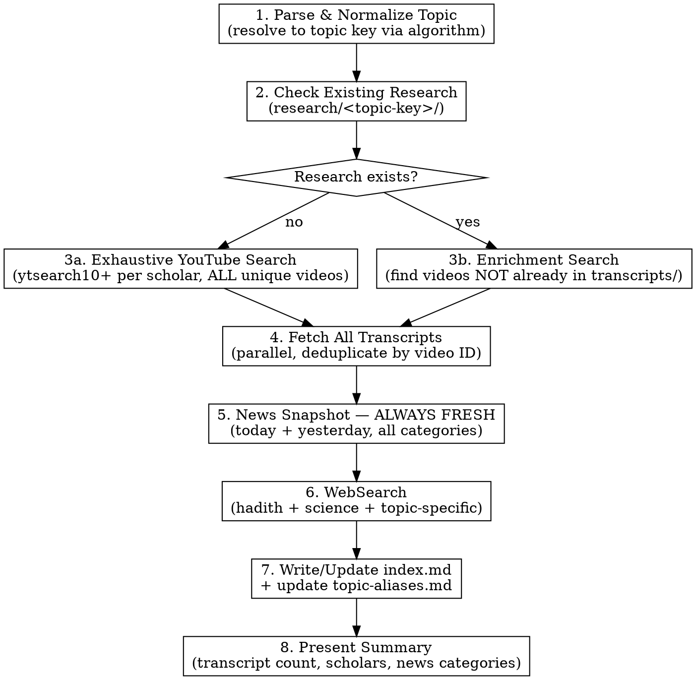
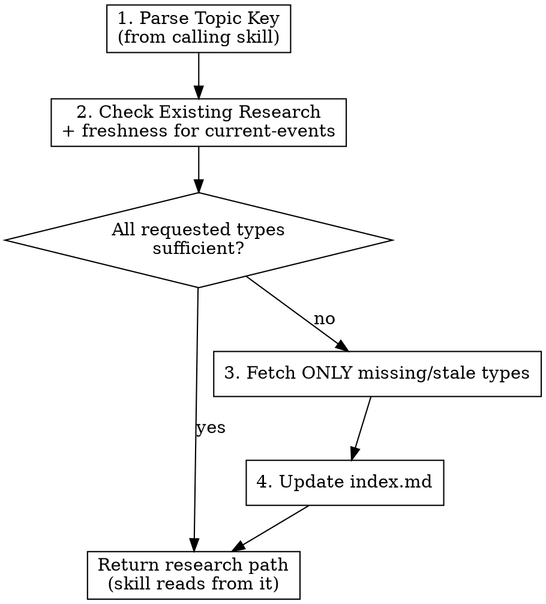

# Centralized Research Skill — Design Spec

**Date:** 2026-03-18
**Status:** Approved
**Problem:** All three content skills (recite, divine, discover) independently fetch YouTube transcripts and run WebSearches for the same scholars and topics. Proven duplication: identical files (same MD5 hash) across sessions for Al-Kahf and Laylatul Qadr.

## Overview

A new `/research` skill that centralizes all research gathering into a shared, topic-keyed directory at `research/` (project root). Skills delegate research to this skill instead of doing it themselves. Research is fetched once, stored permanently (transcripts) or with freshness rules (current events), and reused across all skills and sessions.

**Concurrency assumption:** Skills in this project run sequentially (one `/command` at a time in Claude Code). The research skill does not handle concurrent writes to the same topic directory.

## Directory Structure

```
research/
  topic-aliases.md              ← maps known aliases to canonical topic keys
  <topic-key>/
    transcripts/
      nouman-ali-khan-1.txt
      nouman-ali-khan-2.txt     ← multiple unique videos per scholar
      nouman-ali-khan-3.txt
      yasir-qadhi-1.txt
      yasir-qadhi-2.txt
      omar-suleiman-1.txt
      hamza-yusuf-1.txt
      mufti-menk-1.txt
      dr-israr-ahmed-1.txt
      abdul-nasir-jangda-1.txt
      taimiyyah-zubair-1.txt
      furqan-qureshi-1.txt
      mufti-tariq-masood-1.txt
      mustafa-khattab-1.txt
      ...
    web/
      current-events.md         ← broad news snapshot
      hadith-verification.md    ← verified hadith with grading
      scientific-research.md    ← peer-reviewed studies
    index.md                    ← master index with metadata
```

## Topic Key Normalization

### Algorithm

Topic normalization follows a deterministic procedure:

**Step 1 — Verse reference detection.** If input matches a Surah:Ayah pattern (e.g., `2:255`, `18:1-10`), resolve directly:
- Look up Surah name from number (use a known mapping: 1=al-fatihah, 2=al-baqarah, ... 114=an-nas)
- Format: `<surah-slug>-<ayah>` or `<surah-slug>-<start>-<end>` for ranges
- Examples: `2:255` → `al-baqarah-255`, `18:1-10` → `al-kahf-1-10`

**Step 2 — Named verse/surah detection.** If input is a known verse name or surah name:
- Use WebSearch to resolve to Surah:Ayah, then apply Step 1
- Examples: `Ayat al-Kursi` → resolve to 2:255 → `al-baqarah-255`

**Step 3 — Alias check.** Before creating a new topic directory, check `research/topic-aliases.md` for existing mappings:
```markdown
# Topic Aliases
| Alias | Canonical Key |
|---|---|
| night of power | laylatul-qadr |
| surah qadr | laylatul-qadr |
| 97:1-5 | laylatul-qadr |
| story of the cave | al-kahf-1-10 |
| sleepers of the cave | al-kahf-1-10 |
| patience in quran | sabr |
| tawakkul | tawakkul |
```

**Step 4 — Thematic topics.** If not a verse reference and no alias exists:
- Use the canonical Arabic/Islamic term as the key (e.g., `sabr`, `tawakkul`, `khidr`, `laylatul-qadr`)
- Slugify: lowercase, hyphens for spaces, no special characters
- Add the input as a new alias in `topic-aliases.md`

**Step 5 — Ambiguity.** If the topic could map to multiple existing keys, present options to the user and confirm before proceeding.

### Examples

| Input | Resolution Path | Canonical Key |
|---|---|---|
| `2:255` | Step 1: verse ref | `al-baqarah-255` |
| `Ayat al-Kursi` | Step 2: named verse → 2:255 | `al-baqarah-255` |
| `18:1-10` | Step 1: verse ref | `al-kahf-1-10` |
| `Surah Al-Kahf opening` | Step 2: named surah → 18:1-10 | `al-kahf-1-10` |
| `Laylatul Qadr` | Step 3: alias match | `laylatul-qadr` |
| `the story of Khidr` | Step 3: alias → or Step 4: new | `khidr` |
| `patience in the Quran` | Step 3: alias → or Step 4: new | `sabr` |

## Two Invocation Modes

### Mode 1: Direct Call (Exhaustive)

```
/research laylatul qadr
/research 18:1-10
/research the story of Khidr
```

**Exhaustive research** — fetches everything available:

- **YouTube transcripts**: `ytsearch10` per scholar (not 5), keep ALL unique relevant videos. A single scholar may yield 5-8 transcripts on a major topic.
- **Current events**: Full world news snapshot — today and yesterday's news across ALL major categories (see News Snapshot section below). Always fetched fresh regardless of existing data.
- **Hadith verification**: All relevant hadith verified against sunnah.com
- **Scientific research**: All relevant studies and findings
- **Enrichment**: If research already exists, finds and fetches sources NOT already captured

### Mode 2: Skill-Called (Sufficient)

Skills dispatch a research subagent with a structured request:

```
Research needed for: [topic]
Topic key: [normalized slug]
Needs: transcripts, current-events, hadith-verification, scientific-research
Mode: skill-called
Minimum transcripts: 3
```

**Sufficient research** — fetches only what the calling skill needs and only if not already present:

| Calling Skill | Transcripts | Current Events | Hadith Verification | Science |
|---|:---:|:---:|:---:|:---:|
| `recite` | Yes (3+) | No | No | No |
| `divine` | Yes (3+) | Yes | No | No |
| `discover` | Yes (3+) | Yes | Yes | Yes |
| `quran-explorer` | Optional | No | No | No |

### Sufficiency Check Logic

For each requested research type:

1. **Transcripts**: Sufficient if `transcripts/` contains >= minimum requested files that are non-empty. Does not re-fetch — transcripts are permanent.
2. **Current events**: Sufficient if `web/current-events.md` exists AND its `**Fetched:**` date is within the last 24 hours. **Always re-fetch if older than 24 hours** — news is perishable.
3. **Hadith verification**: Sufficient if `web/hadith-verification.md` exists and is non-empty. Does not re-fetch — hadith grading is permanent.
4. **Scientific research**: Sufficient if `web/scientific-research.md` exists and is non-empty. Does not re-fetch — studies are permanent.

If ALL requested types are sufficient → return research path immediately (no fetching).
If ANY requested type is insufficient → fetch only the missing types.

## Execution Flow — Direct Call



## Execution Flow — Skill-Called



## News Snapshot

When called directly, the research skill fetches a comprehensive world news snapshot — today and yesterday's headlines across all major categories. This gives content skills (especially `divine` Layer 6 and `discover` Section 6) a rich, current view of the world to draw connections from.

When called by a skill that needs `current-events`, the same snapshot is fetched but only if the existing one is older than 24 hours.

### Categories and Search Queries

All searches run **in parallel**. Results saved to `research/<topic-key>/web/current-events.md`.

1. **World Headlines** — `latest world news today`, `yesterday world news headlines`
2. **Business & Economy** — `latest business economy news today`, `stock market economy news yesterday`
3. **Technology & AI** — `latest AI technology news today`, `tech AI news yesterday`
4. **War & Conflicts** — `latest war conflict news today`, `Palestine Sudan Ukraine Yemen war news`
5. **Politics & Governance** — `latest world politics news today`, `US China Russia politics news yesterday`
6. **Muslim World** — `latest Muslim world news today`, `Islamic countries OIC news yesterday`
7. **Nature & Climate** — `latest climate environment nature news today`, `natural disaster weather news`
8. **Health & Science** — `latest health science discovery news today`, `medical research news`
9. **Social Issues** — `latest social issues human rights news today`, `education mental health news`
10. **Tech & Society** — `social media regulation AI ethics news today`, `surveillance privacy digital rights news`

### Current Events File Format

```markdown
# World News Snapshot

**Fetched:** 2026-03-18
**Coverage:** Today + Yesterday

## World Headlines
- [headline 1 — source, date]
- [headline 2 — source, date]
...

## Business & Economy
...

## Technology & AI
...

## War & Conflicts
...

## Politics & Governance
...

## Muslim World
...

## Nature & Climate
...

## Health & Science
...

## Social Issues
...

## Tech & Society
...
```

## Index File Format

Each topic's `index.md` tracks all sources and metadata:

```markdown
# Research Index: [Topic Name]

**Topic Key:** <topic-key>
**Created:** YYYY-MM-DD
**Last Updated:** YYYY-MM-DD
**Mode:** exhaustive | skill-called

## Transcripts

| # | Scholar | File | Video Title | YouTube URL | Lines | Fetched |
|---|---------|------|-------------|-------------|-------|---------|
| 1 | Nouman Ali Khan | nouman-ali-khan-1.txt | Title | URL | 1240 | 2026-03-18 |
| 2 | Nouman Ali Khan | nouman-ali-khan-2.txt | Title | URL | 890 | 2026-03-18 |
| ... | ... | ... | ... | ... | ... | ... |

## Web Research

| Type | File | Last Updated | Sources |
|------|------|-------------|---------|
| Current Events | web/current-events.md | 2026-03-18 | 20 searches |
| Hadith Verification | web/hadith-verification.md | 2026-03-18 | sunnah.com |
| Scientific Research | web/scientific-research.md | 2026-03-18 | 4 studies |
```

## YouTube Research Process

### Scholar List

All scholars from CLAUDE.md, searched in parallel:

1. **Nouman Ali Khan** — `"Nouman Ali Khan [topic] quran"`
2. **Dr. Yasir Qadhi** — `"Yasir Qadhi [topic] tafseer"`
3. **Dr. Omar Suleiman** — `"Omar Suleiman [topic] quran"`
4. **Hamza Yusuf** — `"Hamza Yusuf [topic] Islam"`
5. **Mufti Menk** — `"Mufti Menk [topic] lesson"`
6. **Dr. Israr Ahmed** — `"Dr Israr Ahmed [topic] dars quran"`
7. **Shaykh Abdul Nasir Jangda** — `"Abdul Nasir Jangda [topic] quran"`
8. **Ustadha Taimiyyah Zubair** — `"Taimiyyah Zubair [topic] quran"`
9. **Furqan Qureshi** — `"Furqan Qureshi [topic] quran"`
10. **Mufti Tariq Masood** — `"Mufti Tariq Masood [topic] hadith"`
11. **Dr. Mustafa Khattab** — `"Mustafa Khattab [topic] clear quran"`

### Search and Fetch Process

```bash
# Step 1: Search (parallel, all scholars at once)
# Direct mode: ytsearch10, Skill-called mode: ytsearch5
yt-dlp "ytsearch10:<scholar> <topic> quran" --flat-playlist --print "%(id)s | %(title)s"

# Step 2: Deduplicate by video ID against existing transcripts/ in index.md

# Step 3: Fetch transcripts (parallel, all new videos)
pipx run youtube-transcript-api <VIDEO_ID> 2>/dev/null | python3 -c "
import ast, sys
data = ast.literal_eval(sys.stdin.read())
for entry in data[0]:
    print(entry['text'])
" > research/<topic-key>/transcripts/<scholar-name>-<N>.txt

# Step 4: Verify non-empty and relevant (read first 20-30 lines)
# Discard irrelevant transcripts
```

### Deduplication Rules

- **By video ID**: Never fetch the same video twice (check index.md for existing YouTube URLs/IDs)
- **By title judgment**: Skip videos that appear to be the same lecture re-uploaded or re-titled (use judgment, not a metric — e.g., "Surah Kahf Tafseer Part 1" and "Surah Al-Kahf Tafsir - Part 1" are likely the same)
- **Cross-scholar**: Different scholars discussing the same topic is valuable — always keep both

## Modifications to Existing Skills

All path references in agent prompts use **project-root-relative paths** (e.g., `research/<topic-key>/transcripts/`), not relative paths like `../../`. Agents receive the full research path in their dispatch prompt.

### `recite` Skill

**Remove:** Step 1.5 "YouTube Research" (lines 88-166) — the entire research section including directory structure, search commands, transcript fetching, and research index.

**Remove:** `research/` from session directory structure diagram.

**Add:** New Step 1.5:

```
Step 1.5: Gather Research
- Dispatch research subagent:
  - Topic: [surah-name ayah-range]
  - Needs: transcripts
  - Mode: skill-called
  - Minimum transcripts: 3
- Research path returned: research/<topic-key>/
```

**Update all agent prompts** (Ali 2a-2d, Omar 3a-3d):
- Change "read the research/ directory" to "read all .txt files in research/<topic-key>/transcripts/"
- Pass the full research path as part of each agent's dispatch prompt

**Add to session header** (`00-header.md`):
```markdown
**Research:** research/<topic-key>/
```

### `divine` Skill

**Remove:** Step 2 "YouTube Research + WebSearch" (lines 156-226) — entire research section.

**Remove:** `research/` from session directory structure.

**Add:** New Step 2:

```
Step 2: Gather Research
- Dispatch research subagent:
  - Topic: [verse/theme]
  - Needs: transcripts, current-events
  - Mode: skill-called
  - Minimum transcripts: 3
- Research path returned: research/<topic-key>/
```

**Update agent prompts:**
- Layers 1-5 agents: "read all .txt files in research/<topic-key>/transcripts/"
- Layer 6 agent: "read research/<topic-key>/web/current-events.md AND research/<topic-key>/transcripts/"

### `discover` Skill

**Remove:** Step 2 "Research Phase" (lines 226-304) — YouTube, hadith verification, scientific research, current events.

**Remove:** `research/` from session directory structure.

**Add:** New Step 2:

```
Step 2: Gather Research
- Dispatch research subagent:
  - Topic: [topic]
  - Needs: transcripts, current-events, hadith-verification, scientific-research
  - Mode: skill-called
  - Minimum transcripts: 3
- Research path returned: research/<topic-key>/
```

**Update all agent prompts** (Steps 3-8):
- Section 1-2 agents: "read research/<topic-key>/transcripts/"
- Section 3 agent: "read research/<topic-key>/transcripts/ AND research/<topic-key>/web/hadith-verification.md"
- Section 5 agent: "read research/<topic-key>/web/scientific-research.md"
- Section 6 agent: "read research/<topic-key>/web/current-events.md"

### `quran-explorer` Skill

**Add:** Optional Step 0:

```
Step 0 (Optional): Check for existing research
- If research/<topic-key>/ exists, read transcripts/ for richer analysis
- If not, proceed without — quran-explorer works standalone
```

## Existing Session Migration

Existing sessions with `research/` directories are left as-is. They are historical artifacts. New sessions created after this change will reference the shared `research/` directory. No migration needed — the old sessions still work with their embedded research.

## Draft SKILL.md

The research skill file at `.claude/skills/research/SKILL.md`:

```markdown
---
name: research
description: Use when the user invokes /research with any Quranic verse, hadith, Islamic concept, or theme. Gathers exhaustive YouTube scholar transcripts, current world news, hadith verification, and scientific research into a shared research directory. Also called internally by other skills (recite, divine, discover) to avoid duplicate research.
---

# Research — Centralized Islamic Knowledge Gathering

## Overview

The `/research` command gathers primary source material for any Islamic topic into a shared, reusable `research/` directory at the project root. When called directly, it performs exhaustive research. When called by another skill, it performs sufficient research — only fetching what's missing.

## Input Format

The user provides one of:
- A specific ayah: `/research 2:255`
- An ayah range: `/research 18:1-10`
- A named verse: `/research Ayat al-Kursi`
- A Surah: `/research Surah Al-Qadr`
- A concept: `/research Laylatul Qadr`, `/research tawakkul`
- A theme: `/research patience in the Quran`

## Execution Flow — Direct Call

### Step 1: Parse and Normalize Topic

Resolve the user's input to a canonical topic key using the normalization algorithm:

1. **Verse reference?** (e.g., `2:255`) → `<surah-slug>-<ayah>` (e.g., `al-baqarah-255`)
2. **Named verse/surah?** → WebSearch to resolve to Surah:Ayah, then step 1
3. **Alias check** → read `research/topic-aliases.md` for existing mappings
4. **Thematic topic** → use canonical Arabic/Islamic term, slugified (e.g., `laylatul-qadr`, `sabr`)
5. **Ambiguous** → present options to user, confirm before proceeding

After resolving, update `research/topic-aliases.md` with any new alias → key mappings.

Create directory if needed: `research/<topic-key>/transcripts/` and `research/<topic-key>/web/`

Present the resolved topic and key to the user for confirmation.

### Step 2: Check Existing Research

If `research/<topic-key>/` already exists, read `index.md` to understand what's been gathered. In direct/exhaustive mode, proceed to enrichment — find what's NOT yet captured.

### Step 3: YouTube Scholar Search (Exhaustive)

Search for ALL scholars in parallel using `yt-dlp`:

```bash
# ytsearch10 for exhaustive (direct), ytsearch5 for sufficient (skill-called)
yt-dlp "ytsearch10:Nouman Ali Khan [topic] quran" --flat-playlist --print "%(id)s | %(title)s"
yt-dlp "ytsearch10:Yasir Qadhi [topic] tafseer" --flat-playlist --print "%(id)s | %(title)s"
yt-dlp "ytsearch10:Omar Suleiman [topic] quran" --flat-playlist --print "%(id)s | %(title)s"
yt-dlp "ytsearch10:Hamza Yusuf [topic] Islam" --flat-playlist --print "%(id)s | %(title)s"
yt-dlp "ytsearch10:Mufti Menk [topic] lesson" --flat-playlist --print "%(id)s | %(title)s"
yt-dlp "ytsearch10:Dr Israr Ahmed [topic] dars quran" --flat-playlist --print "%(id)s | %(title)s"
yt-dlp "ytsearch10:Abdul Nasir Jangda [topic] quran" --flat-playlist --print "%(id)s | %(title)s"
yt-dlp "ytsearch10:Taimiyyah Zubair [topic] quran" --flat-playlist --print "%(id)s | %(title)s"
yt-dlp "ytsearch10:Furqan Qureshi [topic] quran" --flat-playlist --print "%(id)s | %(title)s"
yt-dlp "ytsearch10:Mufti Tariq Masood [topic] hadith" --flat-playlist --print "%(id)s | %(title)s"
yt-dlp "ytsearch10:Mustafa Khattab [topic] clear quran" --flat-playlist --print "%(id)s | %(title)s"
```

Launch ALL searches **in parallel**. From results, select all relevant unique video IDs. Deduplicate against existing transcripts in index.md (by video ID). Skip videos that appear to be re-uploads of the same lecture.

### Step 4: Fetch Transcripts

Fetch all new transcripts **in parallel**:

```bash
pipx run youtube-transcript-api <VIDEO_ID> 2>/dev/null | python3 -c "
import ast, sys
data = ast.literal_eval(sys.stdin.read())
for entry in data[0]:
    print(entry['text'])
" > research/<topic-key>/transcripts/<scholar-name>-<N>.txt
```

Verify each transcript is non-empty and relevant (read first 20-30 lines). Discard irrelevant results. Not all scholars will have lectures on every topic — skip gracefully.

### Step 5: News Snapshot (Always Fresh in Direct Mode)

Fetch comprehensive world news — today and yesterday across all categories. Run ALL searches **in parallel**:

1. `latest world news today` + `yesterday world news headlines`
2. `latest business economy news today` + `stock market economy news yesterday`
3. `latest AI technology news today` + `tech AI news yesterday`
4. `latest war conflict news today` + `Palestine Sudan Ukraine Yemen war news`
5. `latest world politics news today` + `US China Russia politics news yesterday`
6. `latest Muslim world news today` + `Islamic countries OIC news yesterday`
7. `latest climate environment nature news today` + `natural disaster weather news`
8. `latest health science discovery news today` + `medical research news`
9. `latest social issues human rights news today` + `education mental health news`
10. `social media regulation AI ethics news today` + `surveillance privacy digital rights news`

Save to `research/<topic-key>/web/current-events.md` with `**Fetched:** YYYY-MM-DD` header.

### Step 6: Hadith Verification

Search for relevant hadith and verify against sunnah.com:

```
WebSearch: "site:sunnah.com [hadith keyword]"
WebSearch: "site:islamweb.net [hadith keyword]"
```

Save to `research/<topic-key>/web/hadith-verification.md` with collection, number, grading, and sunnah.com link for each hadith.

### Step 7: Scientific Research

Search for scientific connections:

```
WebSearch: "[topic] scientific research study"
WebSearch: "[topic] psychology study peer reviewed"
WebSearch: "[topic] modern science discovery"
```

Save to `research/<topic-key>/web/scientific-research.md`.

### Step 8: Write/Update Index

Write or update `research/<topic-key>/index.md` with all transcripts (scholar, file, video title, URL, line count, fetch date) and web research (type, file, last updated, source count).

### Step 9: Present Summary

Present to user:
1. Topic key and research path
2. Total transcripts fetched (by scholar breakdown)
3. News categories covered
4. Hadith verified count
5. Scientific sources found
6. Path: `research/<topic-key>/`

## Execution Flow — Skill-Called

When called by another skill (recite, divine, discover), the research skill receives:
- Topic and topic key
- List of needed research types
- Mode: skill-called
- Minimum transcript count

### Sufficiency Check

1. **Transcripts**: Sufficient if `transcripts/` has >= minimum non-empty files
2. **Current events**: Sufficient if `web/current-events.md` exists AND `**Fetched:**` date is within last 24 hours
3. **Hadith verification**: Sufficient if `web/hadith-verification.md` exists and is non-empty
4. **Scientific research**: Sufficient if `web/scientific-research.md` exists and is non-empty

If all requested types are sufficient → return path immediately.
If any type is insufficient → fetch only missing/stale types, then return path.

## Important Notes

- Launch YouTube searches and WebSearches **in parallel** wherever possible
- Auto-generated captions may have transliteration errors for Arabic terms — downstream skills should interpret using their knowledge
- Not all scholars will have lectures on every topic — skip gracefully
- If a transcript fetch fails (no captions available), note it and move on
- Never fabricate sources — if a search returns nothing, report it honestly
- The `research/` directory is a permanent, growing knowledge base — treat it with care
```

## Summary of Changes

| Skill | Lines Removed | Lines Added | Net Effect |
|---|---|---|---|
| `recite` | ~80 | ~15 | Drops research machinery, gains shared access |
| `divine` | ~70 | ~15 | Same |
| `discover` | ~80 | ~15 | Same |
| `quran-explorer` | 0 | ~10 | Gains optional access to existing research |
| **New: `research`** | — | ~200 | Owns all fetching, deduplication, storage |
